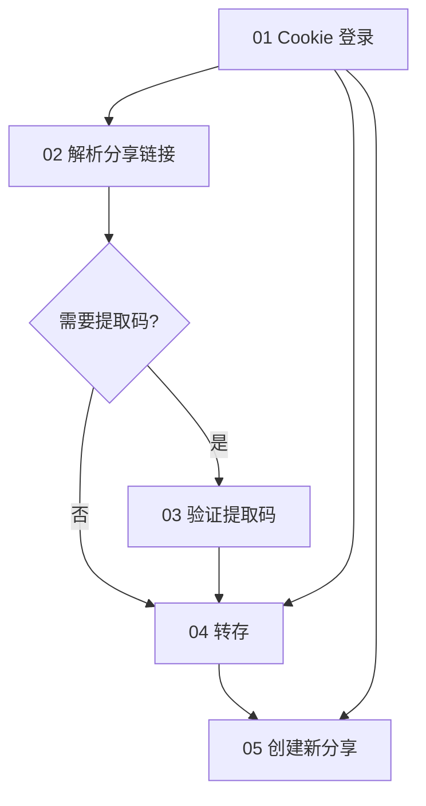

# 子任务拆分设计

## 1. 任务依赖图

## 2. 各子任务 I/O

### 01_cookie_login

- **输入**：Cookie 字符串 / `data/cookies.json`
- **输出**：`ok`, `username`, `quota`, `bdstoken`, `cookie_string`
- **失败**：无 BDUSS、token 失效

### 02_parse_share_link

- **输入**：分享 URL
- **输出**：`surl`, `shareid`, `uk`, `files[].fs_id`, `need_pass`
- **失败**：链接格式错误、yunData 缺失、分享失效

### 03_verify_extract_code

- **输入**：`surl`, `pwd`
- **输出**：`randsk`, `BDCLND` cookie
- **失败**：errno -9 提取码错误

### 04_transfer_save

- **输入**：分享元数据 + sekey + 目标 path + 登录 Cookie
- **输出**：`errno`, `extra.list`（转存后 fs_id）
- **失败**：空间不足(12)、频控(110)

### 05_create_share

- **输入**：`fs_id[]`, `pwd`, `period`
- **输出**：`link`, `shorturl`, `shareid`
- **失败**：黑名单(115)、病毒( -70 )

### 06_pipeline

串联上述步骤，输出 `new_share_link` + `new_share_pwd`。

## 3. 推荐执行顺序（调研）

1. `01` 确认 Cookie 有效
2. `02` 解析目标分享链接结构
3. `03` 单独验证提取码（如有）
4. `04` 转存到测试目录（小文件）
5. `05` 对转存结果创建 7 天分享
6. `06` 跑通全流程

## 4. 风控注意

- 批量转存易触发 errno 110（频控）
- 建议转存间隔 ≥ 5s
- 使用测试账号与小文件验证
