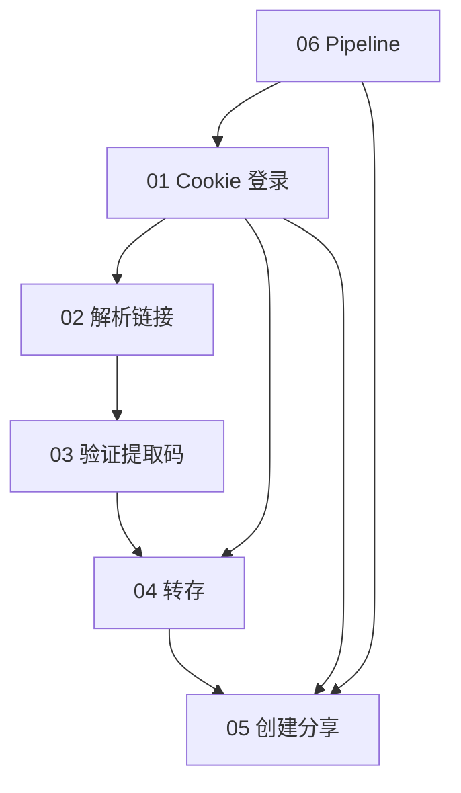

# 夸克网盘子任务设计

## 依赖关系

## 各任务 I/O

### 01_cookie_login
- 输入：Cookie
- 输出：`nickname`, `ok`

### 02_parse_share_link
- 输入：分享 URL
- 输出：`pwd_id`, `passcode`, `pdir_fid`

### 03_verify_extract_code
- 输入：`pwd_id`, `passcode`
- 输出：`stoken`

### 04_transfer_save
- 输入：stoken + 文件列表 + 目标目录
- 输出：`task_id`, `task_data`

### 05_create_share
- 输入：转存后 `fid[]`
- 输出：`link`, `pwd`

### 06_pipeline
- 输出：`new_share_link`, `new_share_pwd`

## 常见错误

| 现象 | 可能原因 |
|------|----------|
| account/info 无 data | Cookie 失效 |
| token 失败 | 提取码错误 |
| save code != 0 | 空间不足 / 频控 |
| task status=3 | 转存失败 |

## 风控建议

- 转存间隔 ≥ 5s
- 使用测试账号
- Cookie 勿提交 Git
