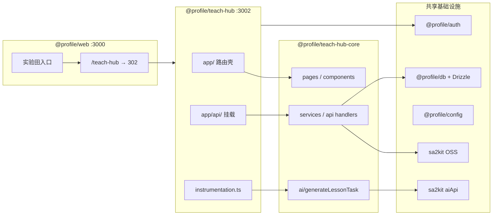
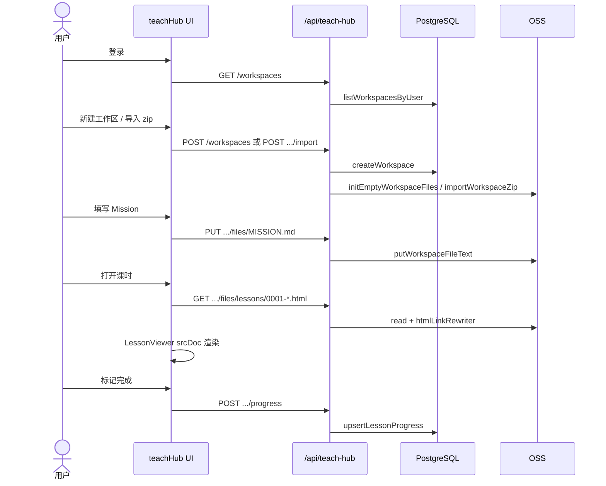
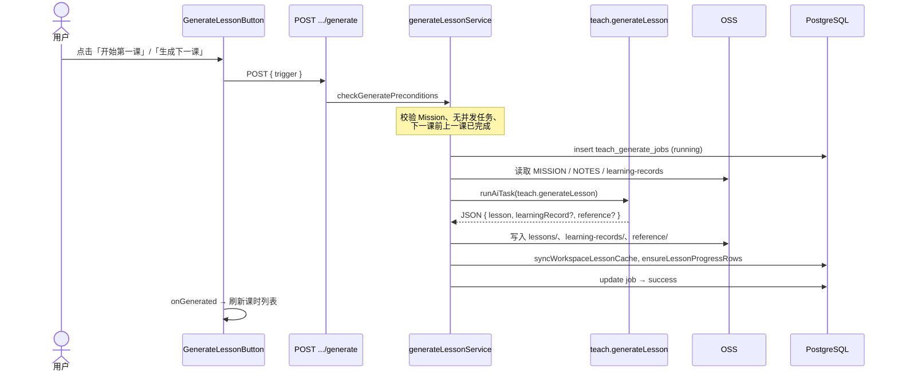
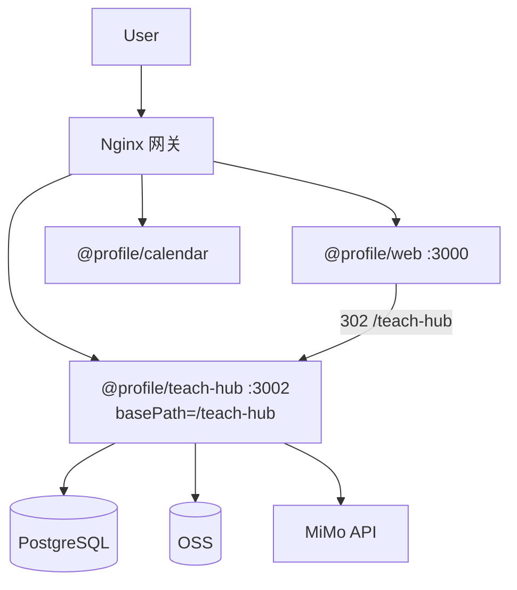

# teachHub 子应用架构

> 视角：`apps/teach-hub`（Next.js 子应用）+ `packages/teach-hub-core`（业务包）  
> 数据契约详见 `packages/teach-hub-core/docs/DATA.md`

## 1. 产品定位

**teach skill 的多租户图形化壳**：一用户 · 多工作区 · 自管进度 · 自触发续课。

| 原则 | 说明 |
|------|------|
| 用户自有工作区 | OSS 路径 `teach-hub/{userId}/{workspaceId}/` |
| 内容格式不变 | 沿用 teach skill 目录契约，HTML 原样 iframe 播放 |
| 状态与内容分离 | OSS = 内容源；DB = 进度 / 索引 / Agent 任务 |
| 无管理员运营课 | 用户创建主题 → 填 Mission → 自己点「生成下一课」 |
| Agent 在站内 | Mimo + teach/SKILL.md，不依赖 Cursor |

## 2. Monorepo 拆分



### 职责边界

| 层 | 包 | 职责 |
|----|-----|------|
| 子应用壳 | `apps/teach-hub` | 路由、layout、API re-export、Docker、basePath |
| 业务核心 | `packages/teach-hub-core` | 页面、组件、服务、API handler、AI 任务 |
| 主站 | `apps/web` | `/teach-hub` 重定向、实验田卡片，**不**直接依赖 core |
| 共享 | `@profile/auth` `@profile/db` | 登录态、PostgreSQL schema 聚合 |

**关键约束**：`teach.generateLesson` AI 任务**仅**在 teach-hub 子进程注册（`instrumentation.ts`），主站 `registerCoreTasks` 刻意排除。

## 3. 技术栈

| 层 | 选型 |
|----|------|
| 框架 | Next.js 16 App Router + React 19 + TailwindCSS |
| UI | animal-island-ui |
| 鉴权 | `@profile/auth` AuthGuard + session cookie |
| 文件存储 | sa2kit OSS，`moduleId: teach-hub` |
| 数据库 | Drizzle + PostgreSQL（3 张表） |
| 课时渲染 | fetch HTML → iframe `srcDoc` + 链接改写 |
| 备课 Agent | aiApi + Mimo OpenAI-compatible API |

## 4. 路由映射

子应用 `app/` 均为薄壳，页面组件来自 `@profile/teach-hub-core`：

| URL（子应用本地） | 页面组件 | 说明 |
|-------------------|----------|------|
| `/` | `TeachHubHomePage` | 工作区列表 |
| `/new` | `NewWorkspacePage` | 创建工作区 |
| `/w/:id` | `WorkspacePage` | 概览：课时列表、进度、生成按钮 |
| `/w/:id/mission` | `MissionPage` | Mission 编辑器 |
| `/w/:id/resources` | `ResourcesPage` | 资源条目编辑器 |
| `/w/:id/records` | `RecordsPage` | 学习记录列表 |
| `/w/:id/settings` | `SettingsPage` | 归档、阅读器设置 |
| `/w/:id/lesson/:slug` | `LessonPage` | 课时阅读（沉浸模式） |
| `/w/:id/reference/:slug` | `ReferencePage` | 速查表（沉浸模式） |

生产网关下实际 URL 为 `/teach-hub/...`（`NEXT_PUBLIC_BASE_PATH`）。

### 布局层级

```
TeachHubLayout（AuthGuard + 顶栏 + Footer）
  └─ WorkspaceShell（面包屑 + Tab 导航）  ← 课时/参考页跳过
       └─ 各 Page 组件
```

沉浸模式（`lesson/`、`reference/`）：隐藏顶栏、Footer、工作区 Tab，全屏阅读。

## 5. 核心工作流

### 5.1 用户学习闭环



### 5.2 Mimo 生成下一课



**前置条件**（`checkGeneratePreconditions`）：

- `first_lesson`：无课时 + Mission 有 Why
- `next_lesson`：最后一课 `status === completed` + Mission 有效
- 全局：无 `running` 状态的 generate job

### 5.3 文件代理与 HTML 改写

课时不走公开 OSS URL，统一走 API 代理：

```
GET /api/teach-hub/workspaces/:id/files/lessons/0001-foo.html
  → readWorkspaceFileText(OSS)
  → rewriteTeachHtmlLinks（相对链 → /api/... 或 /teach-hub/api/...）
  → LessonViewer fetch → srcDoc 注入 iframe
```

`srcDoc` 模式是为规避 OSS/CDN 的 `X-Frame-Options` 拦截（2026-06-15 修复）。

## 6. API 表面

基路径：`/api/teach-hub`（网关下 `/teach-hub/api/teach-hub`）

实现位于 `packages/teach-hub-core/src/api/`，子应用 `app/api/teach-hub/` 仅：

```ts
export { GET, POST } from '@profile/teach-hub-core/api/workspaces/...';
```

| 资源 | 方法 | 路径 |
|------|------|------|
| 工作区列表 | GET | `/workspaces` |
| 创建工作区 | POST | `/workspaces` |
| 工作区详情 | GET | `/workspaces/:id` |
| 更新/归档 | PATCH/DELETE | `/workspaces/:id` |
| 文件列表 | GET | `/workspaces/:id/files` |
| 读/写文件 | GET/PUT | `/workspaces/:id/files/*path` |
| 导入 zip | POST | `/workspaces/:id/import` |
| 进度 | GET/POST | `/workspaces/:id/progress` |
| 生成课时 | POST | `/workspaces/:id/generate` |
| 生成任务状态 | GET | `/workspaces/:id/generate/:jobId` |

所有接口：`requireUser` → `requireWorkspace`（`userId` 来自 session，禁止客户端传入）。

## 7. 数据模型（摘要）

| 存储 | 内容 |
|------|------|
| **OSS** `teach-hub/{userId}/{wsId}/` | MISSION.md, RESOURCES.md, NOTES.md, lessons/, reference/, learning-records/ |
| **DB** `teach_workspaces` | 元数据、lesson_count 缓存 |
| **DB** `teach_lesson_progress` | 每课完成状态、测验分 |
| **DB** `teach_generate_jobs` | Mimo 生成任务记录 |

完整字段见 `packages/teach-hub-core/docs/DATA.md`。

## 8. 前端状态

| 模块 | 路径 | 用途 |
|------|------|------|
| `teachHubStore` | `store/teachHubStore.ts` | 首页工作区列表（Zustand） |
| `useTeachHubBootstrap` | `hooks/useTeachHubBootstrap.ts` | 登录后拉取工作区列表 |
| `teachHubClient` | `services/teachHubClient.ts` | 浏览器侧 API 封装 |
| `useLessonReaderSettings` | `hooks/useLessonReaderSettings.ts` | 阅读进度条偏好（localStorage） |

各 Page 以本地 `useState` + `teachHubClient` 为主，无全局 SWR。

## 9. 部署架构



Docker 构建：`docker build -f apps/teach-hub/Dockerfile .`

关键构建环境变量（Dockerfile 内已设）：

- `NEXT_PUBLIC_BASE_PATH=/teach-hub`
- `NEXT_PUBLIC_TEACH_HUB_BASE_URL=`（空，避免路由双重前缀）
- `output: 'standalone'`

## 10. 路由前缀陷阱（必读）

`packages/teach-hub-core/src/utils/routes.ts` 管理两套前缀：

| 场景 | `TEACH_HUB_BASE`（Link/router） | `teachHubPublicBase()`（HTML 内链） |
|------|--------------------------------|-------------------------------------|
| 本地子应用 `:3002` | `''`（若设了 `NEXT_PUBLIC_TEACH_HUB_BASE_URL=''`） | `''` 或 `/teach-hub` |
| 主站实验田 legacy | `/testField/teachHub` | 同左 |
| 生产网关 | `''`（basePath 已含 `/teach-hub`） | `/teach-hub` |

**历史 bug**：basePath 模式下 Link 再拼 `/teach-hub` 会导致 404（`7ace545` 已修）。

## 11. 阶段与 backlog

| 阶段 | 状态 | 内容 |
|------|------|------|
| Phase 1 | ✅ 完成 | 工作区 CRUD、zip 导入、课时阅读、进度、Mission 编辑 |
| Phase 2 | ✅ 完成 | Mimo 生成第一课 / 下一课 |
| Phase 3 | 待做 | postMessage 测验、间隔重复、zip 导出、starter fork、课内答疑 |

任务追踪：`packages/teach-hub-core/docs/TASKS.md`

## 12. 关键文件速查

| 想改什么 | 先看哪里 |
|----------|----------|
| 页面 UI | `teach-hub-core/src/pages/` |
| 课时阅读器 | `components/LessonViewer.tsx`, `LessonReadingProgress.tsx` |
| 生成按钮逻辑 | `components/GenerateLessonButton.tsx` |
| API 鉴权 | `api/_helpers.ts` |
| OSS 读写 | `services/teachHubFileStore.ts` |
| DB 操作 | `services/teachHubDbService.ts` |
| 生成流程 | `services/generateLessonService.ts` |
| AI prompt | `ai/teachAgentPrompt.ts`, `ai/teachSkillSystemPrompt.ts` |
| 子应用路由 | `apps/teach-hub/app/` |
| AI 任务注册 | `apps/teach-hub/instrumentation.ts` |
| 样式常量 | `styles/tw.ts` |
