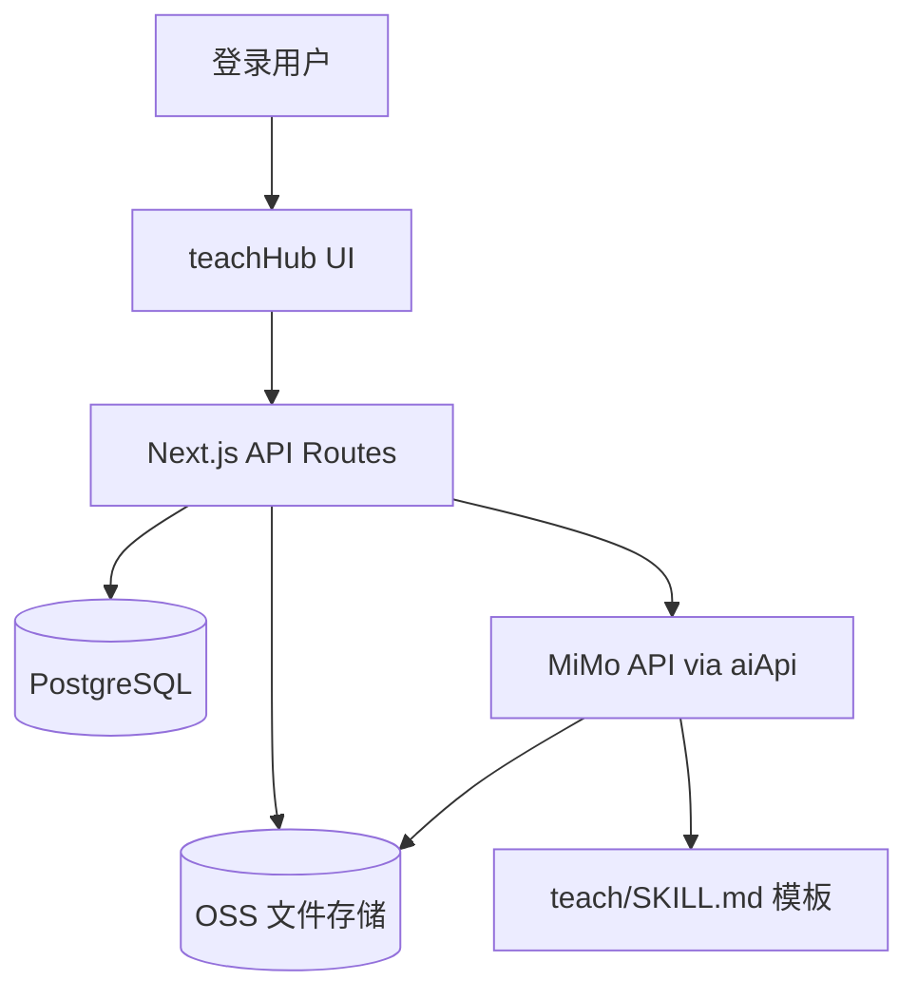

# teachHub 架构说明

## 系统上下文



## 模块边界

| 模块 | 职责 | 不负责 |
|------|------|--------|
| teachHub | 用户工作区 UI、进度、文件代理 | 不改 HTML 为 React |
| teachHub/api | 鉴权、OSS 读写、DB CRUD | 不托管全局课程库 |
| teachHub/ai | Agent prompt、生成校验、写 OSS | 不替代 teach skill 哲学 |
| skillManager | 可选：teach/SKILL.md 版本管理 | 用户学习实例 |
| aiApi | Mimo 调用基础设施 | 业务 prompt |

## 请求流：打开一课

```
1. GET /api/teach-hub/workspaces/:id          → 校验归属
2. GET /api/teach-hub/workspaces/:id/files    → 列出 lessons/
3. GET /api/teach-hub/workspaces/:id/files/lessons/0001-....html
   → 读 OSS 原文
   → htmlLinkRewriter 改写相对链接
   → 返回 text/html
4. LessonViewer iframe srcDoc 渲染
5. POST /api/teach-hub/workspaces/:id/progress → 用户标记完成
```

## 请求流：生成下一课（Phase 2）

```
1. 用户点击「生成下一课」
2. POST /api/teach-hub/workspaces/:id/generate { trigger: 'next_lesson' }
3. 服务端读取 OSS：MISSION + records + lessons 列表 + DB 进度
4. 组装 prompt（system = teach/SKILL.md）
5. aiApi → Mimo 生成 HTML + record md
6. 校验 NNNN 递增、目录契约
7. 写入 OSS，插入 teach_generate_jobs
8. 更新 teach_workspaces.lesson_count
9. 前端刷新课时列表
```

## 安全模型

- **租户键**：`userId`（来自 session，非请求体）
- **工作区键**：`workspaceId`（DB 查归属后使用）
- **OSS 键**：`teach-hub/{userId}/{workspaceId}/...`（仅服务端拼接）

## 扩展点

| 扩展 | 接入位置 |
|------|---------|
| postMessage 测验 | `LessonViewer` + `utils/quizBridge.ts` |
| starter 模板 | `POST /workspaces { forkFrom: 'music-theory-starter' }` |
| 课内答疑 | `POST /workspaces/:id/ask` → aiApi |
