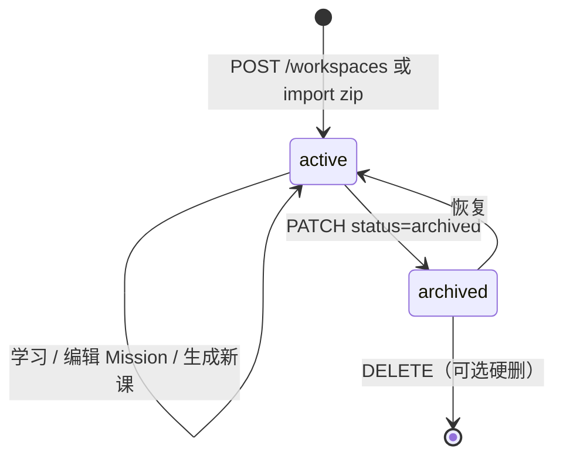

# teachHub 数据文档

## 1. 存储分工

| 类型 | 存储 | 源-of-truth | 说明 |
|------|------|-------------|------|
| teach 内容文件 | OSS | OSS | MISSION、lessons、reference、records、notes |
| 工作区元数据 | DB | DB | 标题、状态、缓存统计 |
| 课时进度 | DB | DB | 完成状态、测验分 |
| Agent 生成任务 | DB | DB | 用户触发的备课记录 |
| teach skill 规范 | 平台全局 | 代码仓 / skillManager | `teach/SKILL.md`，非用户工作区 |

**原则**：OSS 管「学什么内容」；DB 管「学到哪了」。

---

## 2. OSS 路径规范

### 2.1 模块标识

```
moduleId:   teach-hub
businessId: {userId}/{workspaceId}
customPath: teach-hub/{userId}/{workspaceId}/{relativePath}
```

### 2.2 工作区目录契约（与 teach skill 1:1）

```
teach-hub/{userId}/{workspaceId}/
  MISSION.md
  RESOURCES.md
  NOTES.md
  .meta.json                 # 平台扩展，可选
  lessons/
    0001-sound-and-pitch.html
    0002-duration-and-beat.html
  reference/
    sound-dimensions.html
  learning-records/
    0001-zero-prior-knowledge.md
```

### 2.3 文件命名规则

| 类型 | 模式 | 排序 |
|------|------|------|
| lesson | `NNNN-{slug}.html` | 按 NNNN 数字升序 |
| learning-record | `NNNN-{slug}.md` | 按 NNNN 数字升序 |
| reference | `{slug}.html` | 字母序 |

### 2.4 `.meta.json`（平台扩展）

```json
{
  "version": 1,
  "title": "音乐乐理",
  "topic": "music-theory",
  "language": "zh-CN",
  "createdAt": "2026-06-15T00:00:00.000Z",
  "forkedFrom": null
}
```

---

## 3. 数据库表

### 3.1 `teach_workspaces`

用户学习工作区元数据。

| 列 | 类型 | 说明 |
|----|------|------|
| id | text PK | UUID，`workspaceId` |
| user_id | text NOT NULL | 归属用户，FK → users |
| slug | text NOT NULL | URL 友好标识，用户内唯一 |
| title | text NOT NULL | 显示标题 |
| topic | text | 主题标签，如 `music-theory` |
| status | text NOT NULL | `active` \| `archived` |
| mission_summary | text | MISSION Why 段缓存 |
| lesson_count | integer DEFAULT 0 | lessons/ 文件数缓存 |
| last_lesson_slug | text | 最近可用课 slug |
| last_opened_at | timestamp | 最近打开 |
| created_at | timestamp | |
| updated_at | timestamp | |

**索引**：`(user_id, status)`、`(user_id, slug)` UNIQUE

### 3.2 `teach_lesson_progress`

每用户每工作区每课的进度。

| 列 | 类型 | 说明 |
|----|------|------|
| id | text PK | UUID |
| user_id | text NOT NULL | 冗余，便于校验 |
| workspace_id | text NOT NULL | FK → teach_workspaces.id |
| lesson_slug | text NOT NULL | 如 `0001-sound-and-pitch`（无扩展名） |
| lesson_order | integer NOT NULL | 从文件名解析的 NNNN |
| status | text NOT NULL | 见下表 |
| quiz_score | integer | 得分 |
| quiz_total | integer | 满分 |
| started_at | timestamp | |
| completed_at | timestamp | |
| next_review_at | timestamp | Phase 3 间隔重复 |

**status 枚举**：

| 值 | 含义 |
|----|------|
| `locked` | 尚未解锁（Phase 2 顺序解锁可选） |
| `available` | 可学习 |
| `in_progress` | 已开始 |
| `completed` | 已标记完成 |

**索引**：`(workspace_id, lesson_slug)` UNIQUE、`(user_id, workspace_id)`

### 3.3 `teach_generate_jobs`（Phase 2）

用户触发的 Agent 备课任务。

| 列 | 类型 | 说明 |
|----|------|------|
| id | text PK | UUID |
| user_id | text NOT NULL | |
| workspace_id | text NOT NULL | |
| trigger | text NOT NULL | `first_lesson` \| `next_lesson` \| `retry` |
| status | text NOT NULL | `pending` \| `running` \| `success` \| `failed` |
| input_snapshot | jsonb | 触发时读的文件清单 / hash |
| output_files | jsonb | 写入的相对路径列表 |
| error_message | text | |
| created_at | timestamp | |
| finished_at | timestamp | |

---

## 4. API 契约（Phase 1）

基路径：`/api/teach-hub`

所有接口需登录；`workspaceId` 必须属于 `session.userId`。

### 4.1 工作区

| 方法 | 路径 | 说明 |
|------|------|------|
| GET | `/workspaces` | 当前用户工作区列表 |
| POST | `/workspaces` | 创建空工作区 `{ title, topic?, missionDraft? }` |
| GET | `/workspaces/:id` | 详情 + 缓存统计 |
| PATCH | `/workspaces/:id` | 更新 title / status |
| DELETE | `/workspaces/:id` | 归档或硬删（待定） |

### 4.2 文件

| 方法 | 路径 | 说明 |
|------|------|------|
| GET | `/workspaces/:id/files` | 列出相对路径树 |
| GET | `/workspaces/:id/files/*path` | 读文本或返回 HTML（课时用改写版） |
| PUT | `/workspaces/:id/files/*path` | 写 MISSION / NOTES 等 |
| POST | `/workspaces/:id/import` | multipart zip 导入 |
| GET | `/workspaces/:id/export` | zip 下载（Phase 3） |

### 4.3 进度

| 方法 | 路径 | 说明 |
|------|------|------|
| GET | `/workspaces/:id/progress` | 全部课时进度 |
| POST | `/workspaces/:id/progress` | `{ lessonSlug, status, quizScore?, quizTotal? }` |

### 4.4 生成（Phase 2）

| 方法 | 路径 | 说明 |
|------|------|------|
| POST | `/workspaces/:id/generate` | `{ trigger: 'first_lesson' \| 'next_lesson' }` |
| GET | `/workspaces/:id/generate/jobs` | 历史任务列表 |
| GET | `/workspaces/:id/generate/jobs/:jobId` | 单任务状态 |

---

## 5. 类型定义（TS）

见 `src/modules/teachHub/types/index.ts`。

---

## 6. 鉴权规则

1. 未登录 → 401
2. `workspace.user_id !== session.userId` → 403
3. OSS `businessId` 必须由服务端从 session 拼接，**禁止**客户端传入 `userId`
4. 文件读取走服务端代理，不暴露长期公开 OSS URL

---

## 7. 工作区生命周期



---

## 8. 与 musicStudy 样例的映射

| 本地路径 | OSS 相对路径 |
|---------|-------------|
| `MISSION.md` | `MISSION.md` |
| `lessons/0001-sound-and-pitch.html` | `lessons/0001-sound-and-pitch.html` |
| `reference/sound-dimensions.html` | `reference/sound-dimensions.html` |
| `learning-records/0001-zero-prior-knowledge.md` | `learning-records/0001-zero-prior-knowledge.md` |

导入 zip 时校验：至少存在 `MISSION.md` 或 `lessons/` 之一。
