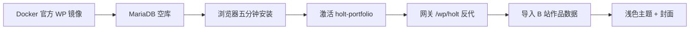

# 03 · 从安装 WordPress 到现在独立运行的 Holt 站

按时间线理解「空容器 → 可访问作品集」。你不需要逐步重做，但要知道每一层为什么存在。

## 阶段总览



## 1. 基础设施（Docker，不是「装 Apache 到宿主机」）

本仓选择：

| 组件 | 镜像 / 服务名 | 作用 |
|------|----------------|------|
| WordPress | `wordpress:6-apache` → `wordpress_holt` | PHP 应用 |
| 数据库 | `mariadb:11` → `wp_mariadb` | 库名默认 `wp_holt` |
| 入口 | 网关 nginx | 公网路径 `/wp/holt/` |

与 Next 子应用（calendar 等）**隔离**：无 pnpm、无 Drizzle、无 better-auth。

生产定义：`deploy/docker-compose.gateway.yml`。  
本地只起 WP：`deploy/wordpress/docker-compose.dev.yml`。

## 2. 环境变量（站点「身份证」）

关键三项：

```bash
WP_HOLT_PUBLIC_URL=https://qhr062.top/wp/holt   # 必须与公网访问前缀一致
WORDPRESS_DB_*                                   # 连 MariaDB
MARIADB_ROOT_PASSWORD                            # 建库 / 运维
```

`WORDPRESS_CONFIG_EXTRA` 里会 `define('WP_HOME'...)` / `WP_SITEURL`，并处理：

- HTTPS 反代头  
- 核心路径被 nginx 去掉前缀后，**补回** `REQUEST_URI` 里的 `/wp/holt`（否则登录会跳到错误的 `/wp-admin` 404）

## 3. 首次安装向导

容器起来后打开 `/wp/holt/`：

1. 选语言  
2. 填站点标题、管理员（Holt 约定用户名可 `holt`，密码约定 `776688`）  
3. 完成后进后台  

此时还是默认主题；内容为空。

## 4. 挂上自定义主题 `holt-portfolio`

- 代码在 git：`wordpress/holt/`（submodule `profile-v1-wordpress-holt`）
- 生产：compose volume + CI `scp` 到服务器同路径  
- 后台：**外观 → 主题 → 启用 Holt Portfolio**

主题会：

- 注册 CPT `work`、角色 taxonomy  
- 自动创建「关于」「联系」页  
- 启用漂亮固定链接 `/%postname%/`  

## 5. 网关路径为什么特殊（必懂）

WordPress 文件在容器**文档根**（`/wp-admin`、`/wp-content`），公网却是 `/wp/holt/...`。

因此 nginx **每站两条规则**（不要给每个页面加 location）：

1. `wp-admin` / `wp-includes` / `wp-content` / `wp-*.php` / `xmlrpc.php` → **去掉** `/wp/holt` 再转发  
2. 其它（首页、`/about/`、`/works/`、`/wp-json/`）→ **保留**完整 URI  

另有安全网：裸 `/wp-admin` 301 到 `/wp/holt/wp-admin/`。

踩坑记录已写入 Agent Skill：`profile-v1-wordpress-sidecar`。

## 6. 内容从哪来

1. 后台手工加作品；或  
2. 抓取 B 站空间 → `wordpress/holt/data/holt-bilibili-works.json` →
   `import-holt-bilibili-works.sh` / Actions 导入 →  
   `sync-holt-work-meta-covers.sh` 补封面  

当前线上约 **175** 条作品，含播放量 / 合集 / 封面等。

## 7. 你现在看到的站

| 能力 | 状态 |
|------|------|
| 路径 | `https://qhr062.top/wp/holt/` |
| 主题 | 浅色「日间工作室」+ 琥珀强调 |
| 作品库 | 合集 / 角色 / 年份 / 仅 Holt 筛选 |
| 单页 | B 站 iframe、播放量、职员表解析 |
| 旧路径 | `/wp/personal/` → 301 到 holt |

## 8. 本地复现「迷你 Holt」

```bash
cd /home/qhr/project/profile-v1/deploy/wordpress
cp -n .env.example .env
docker compose -f docker-compose.dev.yml --env-file .env up -d
```

浏览器：http://127.0.0.1:18080/wp/holt/  
装站 → 启用主题 →（可选）导入 JSON。

下一篇：[04-当前网关部署流程.md](./04-当前网关部署流程.md)
