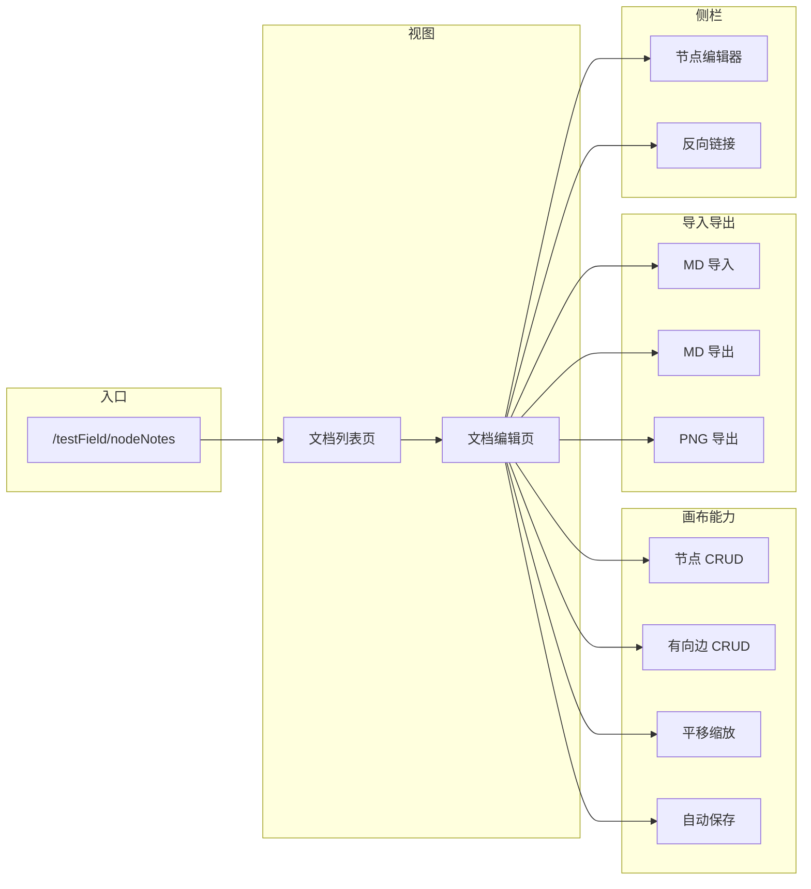

# 节点化笔记模块 — 需求文档

> 项目：profile-v1  
> 模块代号：`nodeNotes`  
> 文档版本：v0.2（需求评审修订）  
> 最后更新：2026-07-11  
> 状态：**已确认核心约束 → 可进入 DEVELOPMENT.md / 开发**

---

## 1. 背景与动机

### 1.1 项目现状

profile-v1 主站（`@profile/web`）已有若干「个人知识/任务」类实验模块：

| 模块 | 形态 | 局限 |
|------|------|------|
| `ideaList` | 线性清单 + 待办项 | 条目之间无显式关联；不适合表达概念网络 |
| `comfyPrompt` | 分组 + 提示词集合 | 面向 ComfyUI 工作流，非通用笔记 |
| TeachHub `NOTES.md` | OSS 单文件 Markdown | 无画布、无节点连线、无可视化导航 |

用户提出 **「节点化笔记」**：将知识单元表示为 **节点（Node）**，节点之间通过 **有向边（Directed Edge）** 建立语义关联，在 **无限画布** 上组织与浏览；并支持 **多篇文档** 管理，以及 **Markdown / 图片** 导入导出。

### 1.2 业务目标

1. 在实验田提供一套 **可登录、可持久化** 的节点化笔记工具，用于个人知识整理、项目脑暴、学习笔记串联。
2. 支持用户创建与管理 **多篇独立文档**，每篇文档是一张完整的节点图谱。
3. 支持 **Markdown 导入与导出**，便于与 Obsidian、VS Code、TeachHub 等生态互通。
4. 支持将当前文档画布 **导出为图片**（PNG），便于分享与存档。
5. 与 `ideaList` **互补**：清单管执行，图谱管关联与结构。
6. 遵循仓库既有约定：模块代码在 `src/modules/nodeNotes/`，路由挂载在 `testField/(utility)/`，API 经 `src/app/api/` 薄转发。

### 1.3 成功标准（MVP）

- 用户可创建 **多篇文档**，在每篇文档的画布上增删改节点、拖拽布局、建立 **有向** 连线。
- 支持将 **单个或多个 `.md` 文件** 导入为节点，或将 **整篇文档** 导出为 Markdown 包。
- 支持将 **当前画布视口** 导出为 PNG 图片。
- 刷新页面或换设备登录后，布局与内容 **完整恢复**。
- 核心交互在桌面端 Chrome/Firefox 流畅可用；移动端可只读或基础编辑（见 §6.2）。

### 1.4 已确认约束（评审结论）

| 约束 | 结论 |
|------|------|
| 边的方向 | **必须有向**；存储、UI、导入导出均保留 `source → target`，不提供无向边 |
| 多文档 | **必须支持**；每用户可拥有多篇独立文档，互不干扰 |
| Markdown | **必须支持导入与导出**（MVP 纳入，非后续迭代） |
| 图片导出 | **必须支持**画布 PNG 导出（MVP 纳入） |

---

## 2. 术语定义

| 术语 | 定义 |
|------|------|
| **文档（Document）** | 用户创建的一篇笔记作品，对应数据库中的一张 **画布（Canvas）**；UI 面向用户统一称「文档」。 |
| **画布（Canvas）** | 文档的可视化编辑平面，包含节点、有向边与视口状态；与 Document 1:1。 |
| **节点（Node）** | 画布上的知识卡片，含标题、正文（Markdown）、屏幕坐标与尺寸。 |
| **有向边（Directed Edge）** | 从 **源节点（source）** 指向 **目标节点（target）** 的关联线，带箭头；可附简短标签。语义：`source → target`（如「引用」「依赖」「推导」）。 |
| **反向链接（Backlink）** | 所有以当前节点为 **target** 的入边及其 **source** 节点列表。 |
| **节点化** | 以节点为最小知识单元，通过有向边表达关系，而非仅依赖文件夹层级或线性列表。 |

---

## 3. 用户与场景

### 3.1 目标用户

- profile-v1 **已登录用户**（与 `ideaList` 相同，走 `@profile/auth` session）。
- 主要使用场景为 **桌面浏览器**；实验田个人工具，非多租户协作产品。

### 3.2 用户故事（MVP）

| ID | 作为… | 我希望… | 以便… |
|----|--------|---------|--------|
| US-01 | 用户 | 在实验田进入「节点笔记」并看到我的 **文档列表** | 在多篇笔记间切换 |
| US-02 | 用户 | 新建一篇文档并命名 | 按主题拆分知识（如「RN 学习」「某项目脑暴」） |
| US-03 | 用户 | 在画布空白处双击或点击「添加节点」创建笔记卡片 | 快速记录想法 |
| US-04 | 用户 | 编辑节点的标题与 Markdown 正文 | 写入结构化内容 |
| US-05 | 用户 | 拖拽节点改变位置，滚轮/触控板缩放与平移画布 | 按空间布局组织知识 |
| US-06 | 用户 | 从节点 A **拖出箭头**连到节点 B，并可选填关系标签 | 表达 **有方向** 的概念关联 |
| US-07 | 用户 | 删除节点或边（含确认） | 清理过时内容 |
| US-08 | 用户 | 关闭页面后再次打开，布局与内容保持不变 | 可靠持久化 |
| US-09 | 用户 | 重命名或删除整篇文档 | 管理多个项目 |
| US-10 | 用户 | 在侧栏看到 **哪些节点指向当前节点**（反向链接） | 浏览知识网络 |
| US-11 | 用户 | **导入一个或多个 `.md` 文件** 到当前文档 | 把已有笔记快速迁入图谱 |
| US-12 | 用户 | **导出当前文档** 为 Markdown 包（zip） | 备份或在其他编辑器继续写 |
| US-13 | 用户 | **导出当前画布为 PNG 图片** | 分享脑图、插入报告或 PPT |
| US-14 | 用户 | 从文档列表 **批量导出** 多篇文档 | 一次性备份全部笔记 |

---

## 4. 功能需求

### 4.1 功能总览



### 4.2 文档列表页（多文档）

| 功能 | 优先级 | 说明 |
|------|--------|------|
| 展示当前用户全部文档 | P0 | 卡片：标题、描述、节点数、边数、更新时间 |
| 新建文档 | P0 | 标题必填，描述可选；创建后进入编辑页 |
| 重命名 / 编辑描述 | P0 | 模态框或内联编辑 |
| 删除文档 | P0 | 二次确认；级联删除节点与边 |
| 进入文档编辑 | P0 | 路由 `/testField/nodeNotes/[documentId]` |
| 搜索文档标题 | P1 | 本地过滤 |
| 单篇文档 Markdown 导出 | P0 | 列表卡片菜单「导出 MD」 |
| 批量 Markdown 导出 | P1 | 多选后下载 zip |
| 文档封面缩略图 | P2 | 可用末次 PNG 导出缓存或自动快照 |

**多文档规则**

- 每篇文档数据完全隔离（独立 `canvas_id`）。
- 默认不跨文档连线；节点 ID 仅在文档内唯一。
- 软上限：每用户 **50 篇文档**（可配置）。

### 4.3 文档编辑页（画布）

| 功能 | 优先级 | 说明 |
|------|--------|------|
| 无限画布平移、缩放 | P0 | 缩放范围 0.25×～2× |
| 渲染所有节点与 **有向边** | P0 | 边必须带箭头；`source → target` 视觉明确 |
| 创建节点 | P0 | 默认落点：视口中心；初始尺寸约 280×160 |
| 拖拽移动节点 | P0 | 松手后触发位置持久化 |
| 选中节点 / 边 | P0 | 高亮；节点打开侧栏编辑器 |
| 编辑节点标题与正文 | P0 | 正文支持 **GitHub 风格 Markdown** 预览切换 |
| 创建有向边 | P0 | 从 **源** 连接桩拖至 **目标** 节点；**禁止自环**；**禁止重复** `(source, target)` |
| 编辑边标签 | P1 | 短文本，≤50 字 |
| 删除节点 / 边 | P0 | 删节点时同步删除关联入边与出边 |
| 撤销 / 重做 | P2 | 后续迭代 |
| 小地图（Minimap） | P1 | 依赖画布库内置能力 |
| 键盘快捷键 | P1 | `Delete` 删选中项、`Esc` 取消选中 |
| **导入 Markdown** | P0 | 工具栏入口，见 §4.7 |
| **导出 Markdown** | P0 | 工具栏入口，见 §4.7 |
| **导出 PNG** | P0 | 工具栏入口，见 §4.8 |

### 4.4 节点编辑器（侧栏）

| 功能 | 优先级 | 说明 |
|------|--------|------|
| 标题输入 | P0 | 单行 |
| Markdown 正文 | P0 | 多行 textarea；「编辑 / 预览」切换 |
| **入边列表（反向链接）** | P0 | `target = 当前节点` 的所有边，展示 `← 源节点标题 [标签]`，点击定位源节点 |
| **出边列表（正向链接）** | P0 | `source = 当前节点` 的所有边，展示 `→ 目标节点标题 [标签]` |
| 单节点导出为 `.md` | P1 | 侧栏「导出本节点」 |
| 节点创建/更新时间 | P2 | 只读展示 |

### 4.5 有向边规则（硬约束）

| 规则 | 说明 |
|------|------|
| 方向性 | 边 **必须有向**；API 创建时必填 `sourceId`、`targetId`，且 `sourceId ≠ targetId` |
| 视觉 | UI 使用带箭头的连接线；hover 显示方向与标签 |
| 存储 | `node_note_edges.source_id` → `node_note_edges.target_id`，**不可**交换后视为同一条边 |
| 重复 | 同一文档内 `(source_id, target_id)` 唯一；允许 A→B 与 B→A **同时存在**（两对相反有向边） |
| 导入导出 | 格式中必须显式保留 `source` / `target`，不可降级为无向 link |
| 反向链接 | 仅统计 **入边**（指向当前节点的边） |

### 4.6 持久化与同步

| 功能 | 优先级 | 说明 |
|------|--------|------|
| 自动保存 | P0 | 节点内容 debounce 800ms；位置/尺寸 debounce 500ms |
| 保存状态指示 | P0 | 「保存中 / 已保存 / 失败可重试」 |
| 乐观更新 | P1 | 前端先更新，API 失败回滚并 toast |
| 冲突处理 | P2 | MVP 单用户单标签页，不做 OT/CRDT |

### 4.7 Markdown 导入 / 导出

#### 4.7.1 交换格式：`node-notes` 文档包（MVP 标准）

采用 **ZIP 包**，内含清单 + 节点 Markdown，便于人工阅读与 Git 管理。

```text
{document-slug}/
  manifest.json          # 文档元数据、视口、节点布局、有向边列表
  nodes/
    {node-id}.md         # 每节点一个文件
```

**`manifest.json` 结构（v1）**

```json
{
  "format": "node-notes",
  "formatVersion": 1,
  "exportedAt": "2026-07-11T02:00:00.000Z",
  "document": {
    "title": "RN 学习笔记",
    "description": "..."
  },
  "viewport": { "x": 0, "y": 0, "zoom": 1 },
  "nodes": [
    {
      "id": "550e8400-e29b-41d4-a716-446655440000",
      "title": "Hooks",
      "file": "nodes/550e8400-e29b-41d4-a716-446655440000.md",
      "position": { "x": 120, "y": 80 },
      "size": { "width": 280, "height": 160 }
    }
  ],
  "edges": [
    {
      "id": "edge-uuid",
      "source": "550e8400-e29b-41d4-a716-446655440000",
      "target": "660e8400-e29b-41d4-a716-446655440001",
      "label": "依赖"
    }
  ]
}
```

**`nodes/{id}.md` 结构**

```markdown
---
title: Hooks
nodeId: 550e8400-e29b-41d4-a716-446655440000
---

正文 Markdown 内容……
```

#### 4.7.2 导出

| 能力 | 优先级 | 说明 |
|------|--------|------|
| 导出当前文档为 ZIP | P0 | 按 §4.7.1 生成；文件名 `{slug}-{yyyyMMdd-HHmm}.zip` |
| 列表页单篇导出 | P0 | 不进入编辑页也可导出 |
| 批量导出多篇 | P1 | 外层 zip，内层每文档一个子目录 |
| 导出扁平 `README.md`（可选） | P1 | 除机器可读包外，附加一篇人类可读索引：节点标题列表 + 邻接表 |

**导出实现**

- **服务端生成**（推荐）：`GET /api/node-notes/documents/[id]/export` 返回 `application/zip`；鉴权后从 DB 组装，避免前端持有全量数据的内存压力。
- 列表批量导出：`POST /api/node-notes/documents/export-batch`，body `{ ids: string[] }`。

#### 4.7.3 导入

| 能力 | 优先级 | 说明 |
|------|--------|------|
| 导入完整 `node-notes` ZIP | P0 | 解析 `manifest.json`，恢复节点、**有向边**、布局；可 **导入为新文档** 或 **合并到当前文档** |
| 导入单个 `.md` 文件 | P0 | 解析 frontmatter `title`（无则用文件名）；在视口中心创建 **一个新节点** |
| 导入多个 `.md` 文件 | P0 | 批量创建节点，按网格自动排版（避免重叠） |
| 导入冲突策略 | P0 | 合并到当前文档时：节点 `id` 冲突则生成新 UUID 并映射边引用 |
| 格式校验 | P0 | 非法 zip / 缺 manifest / 边引用不存在节点 → 明确错误，**整批回滚** |

**导入实现**

- `POST /api/node-notes/documents/import`：`multipart/form-data`，字段 `file`（zip 或 md）、`mode`（`new-document` | `merge`）、`targetDocumentId`（merge 时必填）。
- 前端编辑页与列表页均提供「导入」按钮。

#### 4.7.4 与外部 Markdown 生态的兼容

| 场景 | 行为 |
|------|------|
| 普通 `.md`（无 frontmatter） | 全文作为节点正文，标题取文件名 |
| 含 YAML frontmatter 的 `.md` | 读取 `title`；正文为 frontmatter 之后内容 |
| Obsidian 单文件 | 作为单节点导入；**不**自动解析 `[[wikilink]]` 为有向边（v2 可选） |
| 导出后在 VS Code 编辑节点 md | 再导入 zip 或单文件时按 §4.7.3 处理 |

### 4.8 图片导出（PNG）

| 能力 | 优先级 | 说明 |
|------|--------|------|
| 导出当前视口 | P0 | 仅截取 **当前可见区域** |
| 导出完整画布 | P0 | 自动计算所有节点包围盒，含 padding，输出完整图谱 |
| 分辨率 | P0 | 默认 `scale: 2`（Retina）；可选 1x / 2x |
| 背景 | P0 | 默认浅色纯色背景 `#f8fafc`；可选透明（P1） |
| 文件名 | P0 | `{document-slug}-{yyyyMMdd-HHmm}.png` |
| 实现方式 | — | 客户端 `html-to-image`（或等价库）对 React Flow 视口 DOM 截图；**不经过服务端** |

**交互**

- 工具栏「导出图片 ▾」：子菜单「当前视口」「完整画布」。
- 导出中显示 loading；节点过多时提示「完整画布可能较慢」。

**限制**

- 单篇文档节点数 > 100 时，完整画布导出前弹出确认。
- MVP 不支持 SVG/PDF 导出（v2）。

### 4.9 权限与安全

| 规则 | 说明 |
|------|------|
| 未登录 | 列表页与编辑页均由 `AuthGuard` 拦截，引导登录 |
| 数据隔离 | 所有 API 校验 `user_id`，仅操作本人文档 |
| 输入校验 | 标题长度、正文大小、zip 大小上限（见 §5.3） |
| XSS | Markdown 渲染走安全管线（禁用 raw HTML 或消毒） |
| 导入安全 | zip 解压防路径穿越；限制解压后总大小与文件数 |

---

## 5. 非功能需求

### 5.1 性能（MVP 指标）

| 指标 | 目标 |
|------|------|
| 单文档节点数 | 设计上限 200（超出提示拆分文档） |
| 首屏加载 | 50 节点文档 < 2s（本地 dev 环境） |
| 拖拽帧率 | 桌面端 ≥ 30fps |
| API 响应 | 单次写入 < 500ms（P95，本地 PG） |
| MD 导出 | 100 节点文档 < 3s |
| PNG 完整画布导出 | 50 节点 < 5s（客户端） |

### 5.2 兼容性

| 环境 | 要求 |
|------|------|
| 桌面 Chrome / Firefox / Edge 最新两个大版本 | 完整编辑 + 导入导出 |
| 移动端 | 只读浏览 + 简单编辑；导入导出可降级为「仅下载」 |
| 屏幕宽度 | 列表页响应式；编辑页桌面优先（≥1024px 最佳） |

### 5.3 数据约束

| 字段 | 上限 |
|------|------|
| 文档标题 | 100 字 |
| 文档描述 | 500 字 |
| 节点标题 | 200 字 |
| 节点正文 | 32 KB |
| 边标签 | 50 字 |
| 每用户文档数 | 50（软限制） |
| 单次导入 zip | 20 MB |
| 单次导入 md 文件数 | 50 个 |
| zip 内节点文件数 | 200 |

### 5.4 可维护性

- 模块内维护 `DEVELOPMENT.md` 作为实施 checklist（风格对齐 `ticketMonitor`、`comfyPrompt`）。
- Drizzle schema 挂入 `src/db/schema/index.ts`，迁移走 `pnpm devdb:generate` / `devdb:push`。
- 实验田注册：`experimentData.ts` 追加条目，`path: "/testField/nodeNotes"`。
- 交换格式 `node-notes v1` 写清版本号，便于后续 `formatVersion: 2` 演进。

---

## 6. 范围边界

### 6.1 本期做（MVP）

- 单用户、PostgreSQL 持久化、REST API。
- **多篇文档** + 画布 + 节点 + **仅有向边** + Markdown 节点内容。
- 列表页 + 编辑页 + 自动保存 + 正/反向链接面板。
- **Markdown 导入 / 导出**（`node-notes` zip 包 + 单/多 `.md` 文件）。
- **PNG 图片导出**（当前视口 + 完整画布）。
- 实验田入口与登录鉴权。

### 6.2 本期不做

| 项 | 原因 |
|----|------|
| 多人实时协同编辑 | 复杂度高，与实验田定位不符 |
| 块级（Block）细粒度节点 | MVP 以卡片级节点交付 |
| `[[wikilink]]` 自动解析为有向边 | v2 |
| 全文检索 / 跨文档图谱搜索 | v2 |
| SVG / PDF 导出 | v2 |
| AI 自动摘要、自动连边 | v2 |
| 节点内图片上传（OSS） | v2；导入 md 中的外链图片不自动转存 |
| 独立子应用 / RN 端 | 仅 Web 实验田 |
| 公开分享链接 | 无公开读接口 |
| 无向边 / 无箭头连线 | **产品明确不做** |

### 6.3 与现有模块关系

| 模块 | 关系 |
|------|------|
| `ideaList` | 不合并；v2 可提供「将 idea 转为节点」 |
| `comfyPrompt` | 无直接依赖 |
| TeachHub | 导出 md 包可手动放入工作区；v2 可做一键同步 |

---

## 7. 技术可行性分析

### 7.1 推荐方案（与仓库对齐）

| 层级 | 选型 | 理由 |
|------|------|------|
| 画布 UI | **`@xyflow/react`** | 内置有向边、箭头、连接桩；支持视口截图 hook |
| 状态 | **Zustand** | 选中态、视口、导入导出进度 |
| 数据 | **PostgreSQL + Drizzle** | 与 `ideaList` 一致 |
| API | **Next.js Route Handlers** | 模块内 `api/**`，`src/app/api/node-notes/**` re-export |
| 鉴权 | **`getApiSessionUser`** | 与 `ideaList` 相同 |
| Markdown 渲染 | `react-markdown` + `remark-gfm` | 预览；XSS 安全配置 |
| Markdown 解析 | `gray-matter` | 导入单文件 frontmatter |
| ZIP 读写 | `jszip`（前端可选）/ **`adm-zip`（服务端，项目已有）** | 导出 zip、服务端导入校验 |
| PNG 截图 | **`html-to-image`** | 对 React Flow viewport 元素 `toPng()` |
| 样式 | **Tailwind CSS** | 仓库统一约定 |

### 7.2 路由与目录规划（预定）

```text
路由：
  /testField/nodeNotes                    → 文档列表
  /testField/nodeNotes/[documentId]       → 文档编辑

磁盘：
  src/app/(pages)/testField/(utility)/nodeNotes/page.tsx
  src/app/(pages)/testField/(utility)/nodeNotes/[documentId]/page.tsx

模块：
  src/modules/nodeNotes/
    DEVELOPMENT.md
    index.ts
    types/
    db/schema.ts, nodeNotesDbService.ts
    api/documents/**, nodes/**, edges/**, import/**, export/**
    pages/NodeNotesGalleryPage.tsx, NodeNotesCanvasPage.tsx
    components/NodeCard.tsx, NodeEditorPanel.tsx, CanvasToolbar.tsx, ImportDialog.tsx, ...
    hooks/useNodeNotesCanvas.ts
    services/nodeNotesApi.ts
    utils/
      exportDocumentZip.ts      # 服务端
      importDocumentZip.ts
      exportCanvasPng.ts        # 客户端
      parseMarkdownFile.ts

API 前缀：
  /api/node-notes/documents
  /api/node-notes/documents/[id]
  /api/node-notes/documents/[id]/export
  /api/node-notes/documents/export-batch
  /api/node-notes/documents/import
  /api/node-notes/documents/[id]/nodes
  /api/node-notes/nodes/[id]
  /api/node-notes/edges
  /api/node-notes/edges/[id]
  /api/node-notes/nodes/[id]/links        # 正向+反向链接聚合
```

### 7.3 数据模型草案

```text
node_note_documents          -- 表名可用 documents；对外称「文档」
  id            uuid PK
  user_id       text FK → users
  title         varchar(100)
  description   text nullable
  slug          varchar(120)       -- 导出文件名友好标识，用户内唯一
  viewport      jsonb nullable     -- { x, y, zoom }
  created_at    timestamptz
  updated_at    timestamptz

node_note_nodes
  id            uuid PK
  document_id   uuid FK → documents ON DELETE CASCADE
  title         varchar(200)
  content_md    text
  position_x    double precision
  position_y    double precision
  width         double precision
  height        double precision
  created_at    timestamptz
  updated_at    timestamptz

node_note_edges
  id            uuid PK
  document_id   uuid FK → documents ON DELETE CASCADE
  source_id     uuid FK → nodes ON DELETE CASCADE   -- 有向：源
  target_id     uuid FK → nodes ON DELETE CASCADE   -- 有向：目标
  label         varchar(50) nullable
  created_at    timestamptz
  UNIQUE(document_id, source_id, target_id)
  CHECK (source_id <> target_id)
```

### 7.4 风险与缓解

| 风险 | 影响 | 缓解 |
|------|------|------|
| React 19 与 @xyflow peer 冲突 | 无法启动 | 分支验证依赖版本 |
| 大画布 PNG 导出内存暴涨 | 浏览器卡顿/OOM | 节点数阈值提示；视口导出作备选 |
| 导入恶意 zip | 安全 | 路径穿越检查、大小上限、服务端解压 |
| 有向边在布局密集时难以辨认 | 可用性 | 边标签、hover 高亮、迷你地图 |

---

## 8. 交互草图（信息架构）

### 8.1 文档列表

```text
┌─────────────────────────────────────────────────────────────────┐
│  ← 实验田    节点笔记              [导入 ▾]  [+ 新建文档]        │
├─────────────────────────────────────────────────────────────────┤
│  🔍 搜索文档...                                                  │
│  ┌────────────────┐  ┌────────────────┐  ┌────────────────┐    │
│  │ RN 学习笔记     │  │ 项目 A 脑暴     │  │ 读书笔记        │    │
│  │ 12 节点 · 8 边  │  │ 8 节点 · 5 边   │  │ 3 节点 · 2 边   │    │
│  │ ⋮ 导出MD 删除   │  │                │  │                │    │
│  └────────────────┘  └────────────────┘  └────────────────┘    │
└─────────────────────────────────────────────────────────────────┘
```

### 8.2 文档编辑

```text
┌──────────────────────────────────────────────────────────────────────────┐
│ ← 返回  RN 学习笔记  已保存 ✓  [+节点] [导入▾] [导出MD] [导出图片▾] [适应视口] │
├──────────────────────────────────────────────┬───────────────────────────┤
│                                              │ 节点编辑                   │
│     ┌─────────┐         ┌─────────┐          │ 标题 [___________]        │
│     │ Hooks   │──依赖──▶│ 状态管理 │          │ [编辑] [预览]             │
│     └─────────┘         └─────────┘          │ Markdown 正文...          │
│            │                                 │ ─────────────────────    │
│            │引用                             │ 入边 ← 基础概念 [引用]     │
│            ▼                                 │ 出边 → 性能优化 [推导]     │
│     ┌─────────┐                               └───────────────────────────┘
│     │ 性能优化 │                                                             │
│     └─────────┘         （有向箭头边 + 可平移缩放的无限画布）                  │
└──────────────────────────────────────────────────────────────────────────┘
```

---

## 9. 验收标准（MVP）

| # | 场景 | 预期结果 |
|---|------|----------|
| AC-01 | 未登录访问 `/testField/nodeNotes` | 显示登录引导，不泄露数据 |
| AC-02 | 登录后新建文档「测试」 | 列表出现该文档，DB 有记录 |
| AC-03 | 进入文档，添加 3 个节点并填写 Markdown | 刷新后仍在 |
| AC-04 | 拖拽节点到新位置 | 刷新后位置保持 |
| AC-05 | 节点 A **→** B 连线，标签「依赖」 | 箭头由 A 指向 B；B 的入边列表含 A |
| AC-06 | 尝试创建 B → A 的同时已有 A → B | 允许（两条独立有向边） |
| AC-07 | 尝试创建 A → A | 拒绝，提示不可自环 |
| AC-08 | 删除节点 B | 所有以 B 为 source/target 的边均删除 |
| AC-09 | 删除整篇文档 | 列表无该项；节点与边级联清除 |
| AC-10 | 导出当前文档为 ZIP | 含 `manifest.json` + `nodes/*.md`，边含 source/target |
| AC-11 | 将 AC-10 的 ZIP 导入为新文档 | 节点、有向边、布局与原文档一致（新 UUID 可接受） |
| AC-12 | 导入 3 个独立 `.md` 到当前文档 | 生成 3 个新节点，标题正确，不重叠 |
| AC-13 | 导出「完整画布」PNG | 下载 PNG，包含全部节点与有向箭头 |
| AC-14 | 导出「当前视口」PNG | 仅包含视口内可见内容 |
| AC-15 | 正文含 `<script>` | 预览不执行脚本 |
| AC-16 | 实验田卡片 | 显示「节点笔记」，路径 `/testField/nodeNotes` |

---

## 10. 迭代路线图（建议）

| 版本 | 主题 | 主要增量 |
|------|------|----------|
| **v0.1 MVP** | 多文档图谱 + 导入导出 | 本文 §4 全部 P0 |
| v0.2 | 表达力 | `[[wikilink]]` 解析为有向边、全文搜索、SVG 导出 |
| v0.3 | 集成 | `ideaList` 转节点、TeachHub 同步 |
| v0.4 | 体验 | 撤销重做、节点内 OSS 图片、移动端连线优化 |

---

## 11. 已确认项（原待确认）

| # | 项 | 结论 |
|---|-----|------|
| C1 | 节点粒度 | **卡片级**（MVP） |
| C2 | 边的方向 | **必须有向**，UI 带箭头，不可切换无向 |
| C3 | 多文档 | **必须支持**，每文档独立图谱 |
| C4 | 存储 | PostgreSQL + 登录同步 |
| C5 | MD 导入导出 | **MVP 必做**，格式 `node-notes` zip v1 |
| C6 | 图片导出 | **MVP 必做**，PNG（视口 + 全画布） |
| C7 | 模块代号 | `nodeNotes` |

---

## 12. 下一步

1. 生成 `src/modules/nodeNotes/DEVELOPMENT.md`（API 细表 + 里程碑 M1～M5）。
2. 实施顺序建议：**M1 数据层与文档 CRUD → M2 画布与有向边 → M3 MD 导入导出 → M4 PNG 导出 → M5 实验田注册与验收**。
3. 按 `ideaList` / `ticketMonitor` 模式开发。

---

## 附录 A：参考模块

| 参考 | 借鉴点 |
|------|--------|
| `ideaList` | 用户鉴权、Drizzle schema、hooks + services |
| `ticketMonitor` | DEVELOPMENT.md 结构、里程碑 |
| `comfyPrompt` | 多实体 CRUD、子路由 |
| `adm-zip`（仓库已有） | 服务端 zip 导出 |

## 附录 B：实验田注册预览

```typescript
{
  id: "node-notes",
  title: "节点笔记",
  description: "多文档节点图谱：有向连线、Markdown 导入导出、画布 PNG 导出",
  path: "/testField/nodeNotes",
  tags: ["笔记", "知识图谱", "画布", "Markdown", "导入导出"],
  category: "utility",
  isCompleted: false,
  createdAt: "2026-07-11",
  updatedAt: "2026-07-11",
}
```
