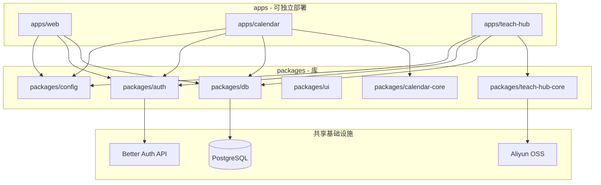

# Monorepo 子应用架构（方案 B → C）

## 1. 逻辑分层



## 2. 应用边界

| 应用 | 职责 | 包含 | 不包含 |
|------|------|------|--------|
| **web** | profile 主站、实验田、首页 | 个人页、testField、非拆出模块 | calendar/teachHub 页面实现 |
| **calendar** | 日历产品与 API | UI、events CRUD、设置 | teach、OSS 课时 |
| **teach-hub** | 学习工作区 | 工作区、课时 HTML、AI 生成 | 日历事件 |

## 3. 代码搬迁映射

| 现状 | 目标 |
|------|------|
| `src/modules/calendar/**` | `packages/calendar-core/**` |
| `src/app/.../calendar/**` | `apps/calendar/app/**` |
| `src/app/api/calendar/**` | `apps/calendar/app/api/calendar/**` |
| `src/modules/teachHub/**` | `packages/teach-hub-core/**` |
| `src/app/.../teachHub/**` | `apps/teach-hub/app/**` |
| `src/app/api/teach-hub/**` | `apps/teach-hub/app/api/teach-hub/**` |
| `src/lib/auth/**` | `packages/auth/**` |
| `src/db/**` + 各模块 `db/schema` | `packages/db/**`（schema 按域分文件 re-export） |
| `scripts/preload-app-config.ts` 等 | `packages/config/**` |

## 4. 依赖规则

- `apps/*` **只能**依赖 `packages/*`，禁止 `apps/calendar` → `apps/web`。
- `packages/calendar-core` **禁止**依赖 `packages/teach-hub-core`。
- `packages/teach-hub-core` 可依赖 `packages/ai`（自 `aiApi` 抽出，ST-16）或短期通过接口注入。
- 共享 `sa2kit`：各 app `transpilePackages: ['sa2kit']`，版本在根 `pnpm-workspace.yaml` catalog 锁定。

## 5. Auth 与会话（B 阶段）

- 三应用共用同一 `BETTER_AUTH_URL` / cookie domain（同主域部署时）。
- 各 app 的 `AuthProvider` 来自 `packages/auth`。
- 子域部署（C 预备）：`auth.{domain}` 或主站签发 session + `trustedOrigins` 扩展（ST-20）。

## 6. 数据库

- **B 阶段**：单一 Postgres，`packages/db` 统一 migrate；`calendar_*`、`teach_hub_*` 表名不变。
- 各 app 仅 import 自己域的 schema + 公共 `user` 表（通过 auth）。
- `src/db/index.ts` 逻辑迁入 `packages/db/src/client.ts`。

## 7. API 与反代

### 选项 A（推荐过渡期）：各 app 自承载 API

- `apps/calendar` 暴露 `/api/calendar/*`
- `apps/teach-hub` 暴露 `/api/teach-hub/*`
- Nginx / 网关按路径转发到不同 upstream

### 选项 B：仅 web 对外，内部转发

- 保持现有 `src/app/api` 路径，handler 改为 `fetch` 内网子应用（复杂，不推荐长期）

## 8. teachHub 特殊耦合

| 耦合点 | 现状 | B 阶段处理 |
|--------|------|------------|
| `registerTeachHubAiTasks` | `aiApi/server/registerCoreTasks.ts` | 迁至 `apps/teach-hub/instrumentation.ts` 或 `packages/teach-hub-core/server/registerTasks.ts` |
| OSS `moduleId: teach-hub` | teachHubFileStore | 不变，路径契约见 teachHub DATA.md |
| HTML 链接改写 | 硬编码 `/testField/teachHub` | `packages/teach-hub-core` 内 `BASE_PATH` 环境变量 |

## 9. calendar 特殊耦合

| 耦合点 | 现状 | B 阶段处理 |
|--------|------|------------|
| `AiApiSettingsProvider` | CalendarPage 内嵌 | 保留；`packages/calendar-core` 依赖 `packages/ai`（可选 ST-16 一并抽） |
| `DateCalculatorTool` | Tab 嵌入 | 短期保留 import；或改为链接跳转 web 的 dateCalculator |
| `examples/calendar-demo` | 独立 demo 路由 | 迁入 `apps/calendar` 或删除，避免 web build 预渲染 |

## 10. 本地开发端口（ST-02）

| 应用 | 包名 | 端口 | `NEXT_DIST_DIR` | 根脚本 |
|------|------|------|-----------------|--------|
| web（当前根） | `personal-website` → 迁至 `@profile/web` | 3000 | `.next` | `pnpm dev:web` |
| calendar | `@profile/calendar` | 3001 | `.next-calendar` | `pnpm dev:calendar` |
| teach-hub | `@profile/teach-hub` | 3002 | `.next-teach-hub` | `pnpm dev:teach-hub` |

> 根目录遗留 `dev:3002` / `dev:3003` 在 ST-07 后按上表收敛；teach-hub 占用 3002。

## 11. pnpm workspace 现状（ST-01）

根 `pnpm-workspace.yaml` 纳入 `apps/*` 与 `packages/*`。迁移前已存在：

| 包名 | 路径 |
|------|------|
| `@sa2kit/exam` | `packages/sa2kit-exam/` |
| `@sa2kit/feishu-bot` | `packages/sa2kit-feishu/` |

与计划中的 `@profile/*` 包共存，无需迁出。

## 12. 构建与 CI（目标）

```yaml
# 概念：各 app 独立 job
jobs:
  build-web:
    run: pnpm --filter @profile/web build
  build-calendar:
    run: pnpm --filter @profile/calendar build
  build-teach-hub:
    run: pnpm --filter @profile/teach-hub build
```

- 根 `turbo.json`：`build` 依赖 `^build`（packages 先构建若有 tsc）。
- Docker：每 app 一个 `Dockerfile` 或多 stage matrix（ST-18）。

## 13. 方案 C 演进预留

| B 能力 | C 时怎么用 |
|--------|------------|
| 独立 `apps/*/Dockerfile` | 直接拆仓，镜像不变 |
| `packages/*` | 发布为私有 npm 或 git submodule |
| 环境变量 `*_PUBLIC_BASE_URL` | 换独立域名 |
| API 前缀不变 | 网关层切换 upstream，客户端无感 |

## 14. 风险

| 风险 | 缓解 |
|------|------|
| 双份代码过渡期 | 绞杀者：切换日删旧路径，控制 ST 周期 |
| drizzle 多 app 引用 schema | 单 `packages/db`，禁止各 app 私建 schema |
| 本地 dev 要开 3 端口 | `turbo dev` + 文档约定端口 3000/3001/3002 |
| teachHub AI 任务重复注册 | 仅从 teach-hub app 注册，web 删除 register 调用 |
