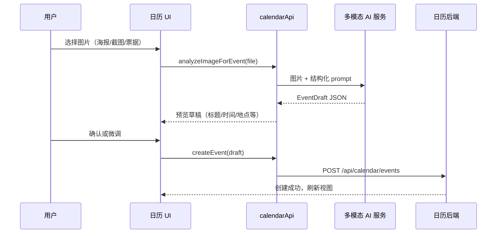

# 日历模块：API 封装与多模态识图创建活动

> 状态：**规划中**（任务 1、2 已完成并推送后启动）  
> 关联：`DEVELOPMENT.md`、现有 hooks `useEnhancedEvents.ts`

## 背景与目标

当前日历模块的 HTTP 调用分散在 `useEvents.ts`、`useEnhancedEvents.ts` 等 hooks 中，不利于统一错误处理、鉴权与后续扩展。下一阶段需要：

1. **封装统一的 API 调用层**（`services/calendarApi.ts`）
2. **接入多模态 AI**：用户上传/拍摄图片 → 模型解析活动信息 → 自动填充并创建一条活动记录

## 用户流程（目标体验）



## 子任务拆分

### 阶段 A：API 封装层（前置，约 1–2 天）

| ID | 任务 | 产出 | 验收标准 |
|----|------|------|----------|
| A1 | 新建 `services/calendarApi.ts` | 统一 fetch 封装 | 所有方法返回 typed `Result` 或 throw 统一 `CalendarApiError` |
| A2 | 迁移 events CRUD | `listEvents` / `createEvent` / `updateEvent` / `deleteEvent` / `batchDelete` | `useEnhancedEvents` 改为调用 calendarApi，行为与现网一致 |
| A3 | 迁移 config API | `getConfig` / `updateConfig` | 与 `/api/calendar/config` 字段映射文档化 |
| A4 | 请求基础设施 | baseUrl、credentials、JSON 解析、401 处理 | 单测或 smoke 脚本可调用 |
| A5 | 类型集中 | `types/api.ts` 或复用 `types/index.ts` | 请求/响应与 route 实现一致 |

**建议接口草案：**

```ts
// services/calendarApi.ts（示意）
export const calendarApi = {
  events: {
    list(params: { startDate: string; endDate: string }): Promise<CalendarEvent[]>,
    create(body: CreateEventPayload): Promise<CalendarEvent>,
    update(id: number, body: UpdateEventPayload): Promise<CalendarEvent>,
    delete(id: number, opts?: { deleteAll?: boolean }): Promise<void>,
    batchDelete(ids: number[]): Promise<void>,
  },
  config: {
    get(): Promise<CalendarConfig>,
    update(body: Partial<CalendarConfig>): Promise<CalendarConfig>,
  },
  ai: {
    analyzeImageForEvent(file: File | Blob): Promise<EventDraft>,
  },
};
```

---

### 阶段 B：多模态 AI 后端（约 2–3 天）

| ID | 任务 | 产出 | 验收标准 |
|----|------|------|----------|
| B1 | 选型与配置 | 环境变量文档（如 `OPENAI_API_KEY` / 兼容 OpenAI 的网关） | 支持 vision 的模型（如 gpt-4o、Claude 3、Qwen-VL 等，按项目现有 AI 基建选定） |
| B2 | 新增 API 路由 | `src/modules/calendar/api/ai/analyze-image/route.ts` + `app/api/calendar/ai/analyze-image` 转发 | 需登录；限制文件大小与 MIME（jpeg/png/webp） |
| B3 | Prompt 与 JSON Schema | `services/ai/eventFromImagePrompt.ts` | 模型输出严格 JSON：`title`, `description?`, `startTime`, `endTime`, `allDay`, `location?`, `confidence` |
| B4 | 图片预处理 | 服务端 resize / 转 base64 或上传 OSS（若已有） | 超大图压缩，避免 token 爆炸 |
| B5 | 容错与降级 | 解析失败返回可读错误码 | 无效 JSON、无时间信息时提示用户手动补全 |

**EventDraft 建议结构：**

```ts
interface EventDraft {
  title: string;
  description?: string;
  startTime: string; // ISO 8601
  endTime: string;
  allDay?: boolean;
  location?: string;
  color?: string;
  priority?: EventPriority;
  confidence: number; // 0–1，低于阈值 UI 高亮需确认
  rawSummary?: string; // 模型简短说明，便于调试
}
```

---

### 阶段 C：前端识图创建 UI（约 2 天）

| ID | 任务 | 产出 | 验收标准 |
|----|------|------|----------|
| C1 | 入口 | 日历页 FAB 旁或创建弹窗内「从图片识别」 | 移动端/桌面端均可选文件或拍照 |
| C2 | 上传与进度 | `ImageToEventPanel.tsx` | loading、预览图、取消 |
| C3 | 草稿预览 | 复用 `ImprovedEventModal` 或独立 `EventDraftModal` | 字段可编辑后再提交 |
| C4 | 创建闭环 | 确认 → `calendarApi.events.create` | 成功后 toast + 刷新当前视图范围 |
| C5 | 低置信度 UX | confidence < 0.6 时字段标黄 | 用户必须确认才能提交 |

---

### 阶段 D：质量与安全（约 1 天）

| ID | 任务 | 说明 |
|----|------|------|
| D1 | 鉴权 | analyze-image 与 create 均需登录，与用户 id 绑定 |
| D2 | 限流 | 每用户每日识图次数上限（防滥用） |
| D3 | 隐私 | 图片不落库或短期缓存后删除（产品决策） |
| D4 | 日志 | 记录 requestId、耗时、模型名，不记录图片内容 |
| D5 | 测试 | 样例图（会议海报、火车票、手写便签）人工回归清单 |

---

### 阶段 E：文档与实验田（约 0.5 天）

| ID | 任务 |
|----|------|
| E1 | 更新 `README.md` API 章节 |
| E2 | 更新 `DEVELOPMENT.md` 勾选进度 |
| E3 | 若对外演示，在实验田说明中补充「识图创建活动」 |

---

## 推荐实施顺序

1. **A1 → A2 → A4**（先打通 events，hooks 瘦身）  
2. **B1 → B2 → B3**（后端识图 API 可用 curl 验证）  
3. **C1 → C2 → C3 → C4**（前端闭环）  
4. **D* + E***（ polish ）

## 依赖与风险

| 项 | 说明 |
|----|------|
| 模型成本 | 按次计费，需限流与可选「仅预览不自动创建」 |
| 时间解析 | 海报上日期格式多样，prompt 需强调 ISO 输出与时区（默认 Asia/Shanghai） |
| 重复活动 | 首版仅创建 **单次活动**（`EventType.SINGLE`），重复规则后续迭代 |
| 与设置联动 | 识图缺省结束时间可沿用 `buildDefaultEventTimes` 的 `defaultEventDuration` |

## 完成定义（DoD）

- [ ] `calendarApi` 为模块内唯一 HTTP 出口（hooks 不再直接 fetch）
- [ ] 上传图片 → 预览草稿 → 创建活动 全链路在测试环境跑通
- [ ] 未登录、超大文件、模型失败三类错误有明确 UI 提示
- [ ] `pnpm build` 通过，关键路径有手动测试记录

---

*文档版本：2026-06-01*
