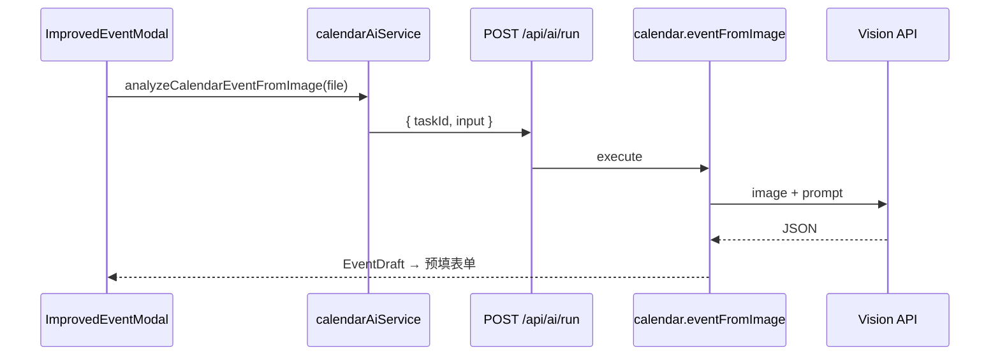

# 日历模块：API 封装与多模态识图创建活动

> 状态：**进行中** — 已通过通用 `aiApi` 模块接入识图创建  
> 通用模块文档：[`../aiApi/DEVELOPMENT.md`](../aiApi/DEVELOPMENT.md)

## 架构调整（2026-06）

识图能力不再放在 `calendar/api/ai/*`，而是：

1. **通用层** `src/modules/aiApi` — 统一 `POST /api/ai/run` + 任务注册
2. **日历域** `src/modules/calendar/ai/eventFromImageTask.ts` — 任务 `calendar.eventFromImage`
3. **客户端** `calendarAiService.ts` + 创建弹窗内 `ImageToEventButton`



## 已完成

- [x] 通用 aiApi 模块与 `/api/ai/run`
- [x] 日历任务 `calendar.eventFromImage`
- [x] 创建活动弹窗「从图片识别」入口
- [x] 低置信度提示（< 0.6）

## 待办

- [ ] `calendarApi.ts` 封装 events CRUD（与 ai 解耦）
- [ ] 识图结果一键创建（当前为预填后用户确认保存）
- [ ] 限流 / 样例图回归清单

## 日历任务契约

**taskId:** `calendar.eventFromImage`

**input:**

```ts
{
  imageBase64: string;
  mimeType: string;
  timezone?: string;
  locale?: string;
  referenceDate?: string;
}
```

**output:**

```ts
{
  title: string;
  description?: string;
  startTime: string; // ISO8601
  endTime: string;
  allDay: boolean;
  location?: string;
  confidence: number;
  rawSummary?: string;
}
```

---

*文档版本：2026-06-01*
