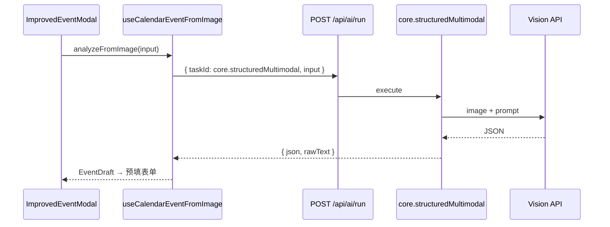

# 日历模块：API 封装与多模态识图创建活动

> 状态：**进行中** — 基于 sa2kit `core.structuredMultimodal` 通用任务  
> 通用模块文档：[`../aiApi/DEVELOPMENT.md`](../aiApi/DEVELOPMENT.md)

## 架构（2026-06 重构）

识图能力不再注册独立服务端任务 `calendar.eventFromImage`，改为：

1. **sa2kit 通用层** — `core.structuredMultimodal`（`sa2kit/common/aiApi`）
2. **日历域提示词** — `src/modules/calendar/ai/eventFromImagePrompt.ts`
3. **客户端** — `useCalendarEventFromImage`（`useAiTask`）+ `ImageToEventButton`
4. **设置 UI** — 仍复用 `@/modules/aiApi` 的 `AiApiSettingsProvider` / `AiApiSettingsPanel`



## 已完成

- [x] 迁移至 sa2kit `core.structuredMultimodal`（移除 `calendar.eventFromImage` 注册）
- [x] 日历域提示词与输出解析独立为 `eventFromImagePrompt.ts`
- [x] `useCalendarEventFromImage` 封装 `useAiTask` + 设置上下文
- [x] 创建活动弹窗「从图片识别」入口
- [x] 低置信度提示（< 0.6）

## 待办

- [ ] `calendarApi.ts` 封装 events CRUD（与 ai 解耦）
- [ ] 识图结果一键创建（当前为预填后用户确认保存）
- [ ] 限流 / 样例图回归清单

## 识图契约（客户端域类型）

**input**（`CalendarEventFromImageInput`）:

```ts
{
  imageBase64: string;
  mimeType: string;
  timezone?: string;
  locale?: string;
  referenceDate?: string;
}
```

**output**（`CalendarEventFromImageOutput`）:

```ts
{
  title: string;
  description?: string;
  startTime: string; // ISO8601
  endTime: string;
  allDay: boolean;
  location?: string;
  confidence: number;
  rawSummary?: string;
}
```

---

*文档版本：2026-06-13*
