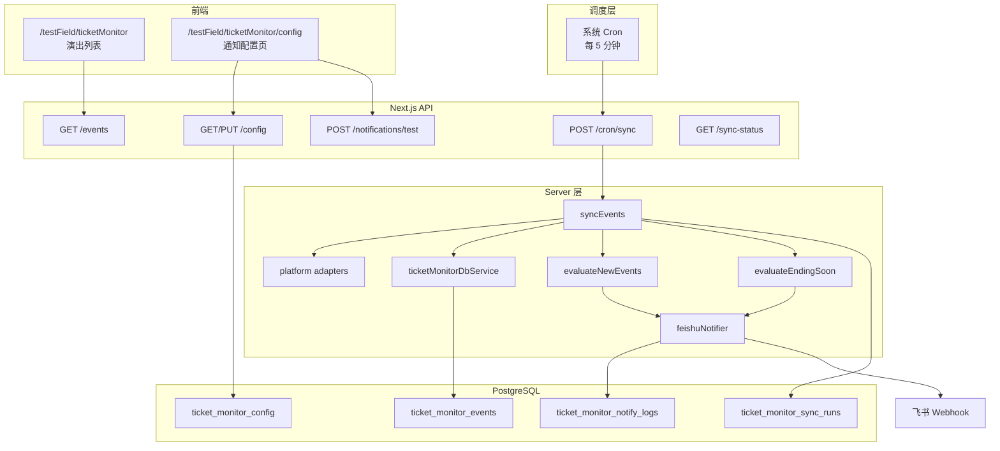

# 售票信息监控模块 — 后台定时爬取 + 飞书通知 升级文档

> 版本：v2.2 规划（规则驱动 + 配置页 + 多档截止提醒）  
> 列表路由：`/testField/ticketMonitor`  
> 配置路由：`/testField/ticketMonitor/config`  
> API 前缀：`/api/ticket-monitor/*`  
> 模块目录：`src/modules/ticketMonitor/`

---

## 1. 背景与目标

### 1.1 现状（v1）

| 能力 | 实现方式 | 问题 |
|------|----------|------|
| 数据抓取 | 用户打开页面或手动刷新时，API 实时调用各平台 adapter | 无后台缓存；关闭页面后不再更新 |
| 变更检测 | 前端 `setInterval` 每 60 秒轮询 | 依赖浏览器常开 |
| 通知 | QQ 机器人 + 用户手动「关注」单场演出 | 渠道不符；需逐场配置，运维成本高 |
| 飞书 | 无 | 未配置 Webhook，无法在 IM 收消息 |
| 持久化 | 无数据库 | 无法 diff、去重、审计 |

### 1.2 升级目标（v2.1）

采用 **全局规则驱动**，不再依赖「逐场关注」：

1. **后台每 5 分钟**自动爬取各平台最新数据并写入 PostgreSQL。
2. **上新演出通知**：爬虫发现某票务平台 **新增演出**（DB 中首次出现）→ 发送飞书通知；**按平台开关**控制哪些源参与；**默认仅开启 asobistore**。
3. **截止售卖提醒**：支持配置 **多个提前天数档位**（如 7 / 3 / 1 天）；某演出进入某一档位窗口时发送飞书提醒；**每个档位独立去重**。**未配置任何档位时默认 `[3]`**（即仅 3 天档）。
4. **飞书配置页**：提供独立配置界面，可填写 / 修改 Webhook、签名密钥、通知开关、平台开关、截止档位列表，并支持 **发送测试消息**。
5. 列表页读 **DB 缓存**；移除浏览器轮询、QQ 推送、localStorage 关注列表。

### 1.3 非目标（本阶段不做）

- 用户登录与多租户（全局一份通知配置，适合实验田 / 个人运维）。
- 逐场演出订阅（v1 关注列表逻辑废弃，不再迁移）。
- 邮件 / 短信 / 企业微信等其它渠道。
- 新增售票平台 adapter（沿用 eplus / asobistore / piapro / lawsonticket）。

---

## 2. 通知规则（核心业务逻辑）

### 2.1 规则 A：上新演出

```
触发条件（全部满足）：
  ① sync 写入时发现 event_id 在 DB 中不存在（首次入库）
  ② 配置项 newEventEnabled = true
  ③ event.source 在 newEventPlatforms 列表中

dedupe_key：new_event:{event_id}
```

**飞书消息示例：**

> 【票务监控·新演出】  
> 平台：asobistore  
> 演出：XXXX LIVE 2026  
> 开票时间：2026-07-24 09:00  
> [前往官网](https://...)

### 2.2 规则 B：截止售卖临近（多档）

```
有效档位列表 effectiveDays =
  config.endingSoonDaysList 非空 → 去重、降序排序后的正整数数组
  否则 → [3]   // 完全未配置时的默认值

对每条 event、每个档位 D ∈ effectiveDays，若全部满足：
  ① event.ticketEndAt 存在且可解析
  ② 0 < (ticketEndAt - now) ≤ D × 24h
  ③ config.endingSoonEnabled = true
  ④ dedupe_key 未发送过

dedupe_key：ending_soon:{event_id}:{ticketEndAt}:{D}
```

说明：

- **多档独立**：每个档位 D 各自判断、各自 dedupe。例：配置 `[7, 3, 1]` 时，进入 7 天窗口发一次，进入 3 天窗口再发一次，进入 1 天窗口再发一次。
- **档位含义**：D 表示「距截止售卖时间还剩 **≤ D 天**」时触发（含当天）。
- **默认行为**：`endingSoonDaysList` 为 `null` / `[]` 时，运行时视为 `[3]`。
- **排序建议**：存储时去重并按 **降序** 排列（如 `[7, 3, 1]`），便于 UI 展示；判定顺序不影响结果。
- 若源站更新了 `ticketEndAt`，各档位 dedupe_key 均变化，可重新通知。

**示例时间线**（截止 5 月 26 日 23:59，档位 `[7, 3, 1]`）：

| 当前时间 | 剩余 | 命中档位 | 动作 |
|----------|------|----------|------|
| 5 月 18 日 | 8 天 | 无 | 不通知 |
| 5 月 20 日 | 6 天 | 7 天档 | 发「7 天档提醒」（首次） |
| 5 月 24 日 | 2 天 | 3 天档 | 发「3 天档提醒」（7 天档已发过） |
| 5 月 26 日上午 | <1 天 | 1 天档 | 发「1 天档提醒」 |

**飞书消息示例：**

> 【票务监控·即将截止】  
> 平台：asobistore  
> 演出：YYYY 抽选受付  
> 提醒档位：3 天  
> 截止售卖：2026-05-26 23:59  
> 剩余：约 2 天  
> [前往官网](https://...)

### 2.3 不触发的场景

| 场景 | 处理 |
|------|------|
| Webhook 未配置或 notificationsEnabled=false | 跳过发送，sync 仍正常写库 |
| 某平台 adapter 失败 | 该平台本轮无数据；errors 记入 sync_runs |
| 演出已 ended / ticketEndAt 已过 | 不触发截止提醒 |
| 5 分钟内重复 sync | dedupe_key 拦截重复通知 |

---

## 3. 目标架构



---

## 4. 数据模型

### 4.1 `ticket_monitor_events`（演出快照）

与 v1 adapter 产出对齐，按 `event_id` upsert。

| 字段 | 类型 | 说明 |
|------|------|------|
| `id` | serial PK | |
| `event_id` | varchar(128) UNIQUE | adapter 生成的稳定 ID |
| `source` | varchar(32) | eplus / asobistore / piapro / lawsonticket |
| `title` | text | |
| `reception_title` | text nullable | |
| `seat_info` | text nullable | |
| `ticket_open_at` | timestamptz | |
| `ticket_end_at` | timestamptz nullable | 截止售卖提醒依赖此字段 |
| `status` | varchar(16) | upcoming / on_sale / ended / unknown |
| `event_url` | text | |
| `cover_image` | text nullable | |
| `location` | text nullable | |
| `tags` | jsonb | string[] |
| `content_hash` | varchar(64) | 内容变更追踪（本版通知不依赖，预留） |
| `first_seen_at` | timestamptz | **首次入库时间**，判定「新演出」 |
| `fetched_at` | timestamptz | 最近一次 sync 更新时间 |
| `created_at` / `updated_at` | timestamptz | |

**新演出判定**：insert 时设置 `first_seen_at`；若 `SELECT` 无此 `event_id` → 视为新演出。

### 4.2 `ticket_monitor_config`（通知配置，单行）

全局唯一配置，UI 配置页读写此表。首访无记录时返回默认值。

| 字段 | 类型 | 默认 | 说明 |
|------|------|------|------|
| `id` | serial PK | 1 | 固定单行 id=1 |
| `notifications_enabled` | boolean | false | 总开关 |
| `feishu_webhook_url` | text nullable | null | 飞书自定义机器人 Webhook |
| `feishu_sign_secret` | text nullable | null | 可选签名校验密钥 |
| `new_event_enabled` | boolean | true | 上新通知开关 |
| `new_event_platforms` | jsonb | **`["asobistore"]`** | `TicketSource[]`，默认仅 asobistore |
| `ending_soon_enabled` | boolean | true | 截止提醒开关 |
| `ending_soon_days_list` | jsonb | **`[]`（运行时等价 `[3]`）** | 正整数数组，多档提前天数 |
| `updated_at` | timestamptz | | |

```ts
// new_event_platforms 默认
["asobistore"]

// ending_soon_days_list 示例（用户配置后）
[7, 3, 1]

// ending_soon_days_list 为空时，服务端 resolve 为
[3]
```

> Webhook URL 存 DB 而非仅 env，方便配置页管理；env 可作为 **初始种子**（可选 `TICKET_MONITOR_FEISHU_WEBHOOK_URL` 首次 bootstrap）。

### 4.3 `ticket_monitor_notify_logs`（通知审计 + 去重）

| 字段 | 类型 | 说明 |
|------|------|------|
| `id` | serial PK | |
| `event_id` | varchar(128) nullable | 新演出 / 截止提醒均关联 |
| `trigger_type` | varchar(32) | `new_event` \| `ending_soon` |
| `dedupe_key` | varchar(256) UNIQUE | 防重复 |
| `source` | varchar(32) nullable | |
| `title` | text nullable | 消息摘要 |
| `payload` | jsonb | 发送体摘要 |
| `feishu_status` | varchar(16) | success / failed |
| `error_message` | text nullable | |
| `sent_at` | timestamptz | |

### 4.4 `ticket_monitor_sync_runs`（同步任务记录）

| 字段 | 类型 | 说明 |
|------|------|------|
| `id` | serial PK | |
| `started_at` / `finished_at` | timestamptz | |
| `duration_ms` | int | |
| `sources_total` / `sources_failed` | int | |
| `events_upserted` | int | |
| `new_events_found` | int | 本轮新发现演出数 |
| `ending_soon_triggered` | int | 本轮命中截止规则数 |
| `notifications_sent` | int | 实际发送成功数 |
| `errors` | jsonb | string[] |
| `status` | running / success / partial / failed | |

在 `types.ts` 中补充：

```ts
/** DB 为空时服务端 fallback */
export const DEFAULT_ENDING_SOON_DAYS_LIST = [3] as const;
export const DEFAULT_NEW_EVENT_PLATFORMS: TicketSource[] = ['asobistore'];

export function resolveEndingSoonDaysList(raw: number[] | null | undefined): number[] {
  const filtered = (raw ?? []).filter((d) => Number.isInteger(d) && d >= 1);
  if (!filtered.length) return [...DEFAULT_ENDING_SOON_DAYS_LIST];
  return [...new Set(filtered)].sort((a, b) => b - a);
}
```

### 4.5 Schema 挂载

- `src/modules/ticketMonitor/db/schema.ts`
- 聚合至 `src/db/schema/index.ts`
- 迁移：`pnpm devdb:generate` → `pnpm devdb:push`

---

## 5. API 设计

### 5.1 `GET /api/ticket-monitor/events`（改造）

| 项 | v1 | v2.1 |
|----|----|------|
| 数据来源 | 实时 adapter | **读 DB 缓存** |
| 查询参数 | q, source, status, sortByEndAtDesc, limit | 不变 |
| meta | fetchedAt, errors | + `lastSyncAt` |

### 5.2 `GET /api/ticket-monitor/config`

返回当前通知配置。Webhook / Secret **脱敏**展示（如 `https://...hook/****abcd`）。

### 5.3 `PUT /api/ticket-monitor/config`

请求体：

```json
{
  "notificationsEnabled": true,
  "feishuWebhookUrl": "https://open.feishu.cn/open-apis/bot/v2/hook/xxxx",
  "feishuSignSecret": "",
  "newEventEnabled": true,
  "newEventPlatforms": ["asobistore"],
  "endingSoonEnabled": true,
  "endingSoonDaysList": [7, 3, 1]
}
```

校验：

- `endingSoonDaysList`：数组，每项为正整数且 ≥ 1；保存前去重；允许传 `[]` 表示使用默认 `[3]`
- `newEventPlatforms` 元素必须为合法 `TicketSource`；允许空数组（即不上新通知任何平台）
- Webhook URL 格式以 `https://` 开头

**GET 响应额外字段**（便于前端展示默认行为）：

```json
{
  "endingSoonDaysList": [],
  "effectiveEndingSoonDaysList": [3]
}
```

`effectiveEndingSoonDaysList` 为服务端 resolve 后的实际生效档位，只读。

### 5.4 `POST /api/ticket-monitor/notifications/test`

使用 **当前已保存** 或 **请求体传入** 的 Webhook 发送测试消息，验证配置是否生效。

```json
{
  "feishuWebhookUrl": "https://..."  // 可选，不传则用 DB 中已存值
}
```

### 5.5 `POST /api/ticket-monitor/cron/sync`

- 鉴权：`Authorization: Bearer ${TICKET_MONITOR_CRON_SECRET}`
- 流程见 §6

### 5.6 `GET /api/ticket-monitor/sync-status`

返回最近一次 `sync_runs` 摘要（列表页展示「后台最近同步」）。

### 5.7 鉴权（MVP）

测试路由阶段：config 写操作与 test 通知可用简单 **Admin Token**（`TICKET_MONITOR_ADMIN_TOKEN` Header）或内网限制；读 config 可开放。cron 接口必须 Secret。

---

## 6. Sync 主流程

```
1. 读取 ticket_monitor_config（id=1）
2. 创建 sync_run（running）
3. 并行调用各 platform adapter
4. 对每条 event：
   a. 查 DB：event_id 是否存在
   b. 不存在 → INSERT（first_seen_at=now）→ 加入 newEvents[]
   c. 存在 → UPDATE 字段 + fetched_at
5. evaluateNewEvents(newEvents, config)
   → 过滤平台 → 发送飞书 → 写 notify_logs
6. evaluateEndingSoon(allEventsInDb或本轮events, config)
   → resolve effectiveDays（空则 [3]）
   → 对每个 event × 每个档位 D：计算 daysLeft → dedupe → 发送飞书
7. 更新 sync_run 汇总 → status=success|partial|failed
8. 返回 JSON
```

---

## 7. 飞书通知实现

### 7.1 发送模块

- `src/modules/ticketMonitor/server/notifications/feishuNotifier.ts`
- `src/modules/ticketMonitor/server/notifications/buildTicketMessage.ts`

首版使用 `msg_type: "post"` 富文本（标题 + 多行 + 链接），参考 [飞书自定义机器人文档](https://open.feishu.cn/document/client-docs/bot-v3/add-custom-bot)。

### 7.2 签名校验（可选）

若配置了 `feishu_sign_secret`，按官方规则对 timestamp + secret 做 HMAC-SHA256，附加 `timestamp` / `sign` 请求头。

### 7.3 失败处理

- 单次发送失败：记 `notify_logs.feishu_status=failed`，不阻断 sync。
- Webhook 无效：test 接口即时反馈；sync 时跳过并记 error 计数。

---

## 8. 配置页面设计

### 8.1 路由与入口

| 项 | 值 |
|----|-----|
| 路径 | `/testField/ticketMonitor/config` |
| 文件 | `src/app/(pages)/testField/(utility)/ticketMonitor/config/page.tsx` → 薄封装 |
| 组件 | `src/modules/ticketMonitor/pages/TicketMonitorConfigPage.tsx` |
| 入口 | 列表页顶部按钮「通知配置」 |

### 8.2 页面结构（Tailwind，响应式）

```
┌─────────────────────────────────────────────┐
│  ← 返回列表    票务监控 · 通知配置            │
├─────────────────────────────────────────────┤
│  【飞书机器人】                               │
│  ○ 启用通知总开关                             │
│  Webhook URL    [________________] 👁         │
│  签名密钥(可选)  [________________]            │
│  [发送测试消息]                               │
├─────────────────────────────────────────────┤
│  【上新演出通知】                             │
│  ○ 启用                                      │
│  监听平台：☐ eplus ☑ asobistore ☐ piapro     │
│            ☐ LawsonTicket   （默认仅 asobistore）│
│  说明：爬虫首次发现该平台新演出时推送           │
├─────────────────────────────────────────────┤
│  【截止售卖提醒】                             │
│  ○ 启用                                      │
│  提前档位（天）： [7] [3] [1]  [+ 添加档位]   │
│  未添加任何档位时，默认按 3 天提醒             │
│  说明：进入各档位窗口各推送一次（档位独立去重）  │
├─────────────────────────────────────────────┤
│  [保存配置]                                   │
│  最近同步：2026-05-23 14:30 · 新发现 2 · 提醒 1│
└─────────────────────────────────────────────┘
```

### 8.3 交互要点

- Webhook / Secret 输入框支持显示/隐藏。
- 「发送测试消息」：未保存也可先用表单内 URL 测试；成功后提示。
- **截止档位**：chip 列表 +「添加档位」；每项可删除；输入正整数；保存前去重排序；列表为空时 UI 提示「将使用默认 3 天档」。
- 保存成功 toast；校验失败 inline 错误。
- 底部只读展示 `sync-status` 摘要。

---

## 9. 列表页改造要点

文件：`src/app/(pages)/testField/(utility)/ticketMonitor/page.tsx`（后续拆至 `src/modules/ticketMonitor/pages/`）

| 移除 | 新增/保留 |
|------|-----------|
| localStorage 关注列表 | 「通知配置」入口 |
| 60s setInterval 轮询 | SyncStatusBar（最近 sync 时间） |
| QQ 推送 UI / sendQqBotNotification | 演出列表、筛选、adapter 数据展示 |
| 「关注演出」按钮与弹窗 | 抢票账号 localStorage（与通知无关，可保留） |

---

## 10. 调度方案

**推荐：系统 Cron + HTTP**

```bash
*/5 * * * * curl -fsS -X POST \
  -H "Authorization: Bearer $TICKET_MONITOR_CRON_SECRET" \
  https://<domain>/api/ticket-monitor/cron/sync \
  >> /var/log/ticket-monitor-cron.log 2>&1
```

**本地调试：**

```json
"ticket-monitor:sync": "dotenv -e .env.development -- tsx src/modules/ticketMonitor/scripts/run-sync.ts"
```

---

## 11. 目录结构（目标）

```
src/modules/ticketMonitor/
├── DEVELOPMENT.md
├── index.ts
├── types.ts
├── db/
│   ├── schema.ts
│   └── ticketMonitorDbService.ts
├── server/
│   ├── getTicketEvents.ts          # 读缓存
│   ├── syncEvents.ts               # cron 主流程
│   ├── evaluateNewEvents.ts
│   ├── evaluateEndingSoon.ts
│   ├── adapters/                   # 现有 4 个 adapter
│   └── notifications/
│       ├── feishuNotifier.ts
│       └── buildTicketMessage.ts
├── api/
│   ├── config/route.ts
│   ├── cron/sync/route.ts
│   ├── events/route.ts
│   ├── notifications/test/route.ts
│   └── sync-status/route.ts
├── pages/
│   ├── TicketMonitorPage.tsx
│   └── TicketMonitorConfigPage.tsx
├── components/
│   ├── EventFilters.tsx
│   ├── EventList.tsx
│   └── SyncStatusBar.tsx
├── scripts/run-sync.ts
└── services/ticketMonitorApi.ts

src/app/api/ticket-monitor/**           # 薄 re-export
src/app/(pages)/testField/(utility)/ticketMonitor/
├── page.tsx
└── config/page.tsx
```

---

## 12. 开发里程碑

### M1 — 数据层 + 定时同步

- [x] Drizzle schema（events / config / logs / sync_runs）
- [x] `syncEvents.ts`：adapter → upsert → 识别 newEvents
- [x] `POST /cron/sync` + `GET /sync-status`
- [x] `pnpm ticket-monitor:sync` 脚本
- [x] `GET /events` 改读 DB

### M2 — 通知规则 + 飞书

- [x] `evaluateNewEvents` + `evaluateEndingSoon` + dedupe
- [x] `feishuNotifier.ts` + 消息模板
- [x] config 默认值 seed（id=1）

### M3 — 配置页

- [x] `GET/PUT /config` + 脱敏
- [x] `POST /notifications/test`
- [x] `TicketMonitorConfigPage` UI
- [x] 列表页入口 + SyncStatusBar

### M4 — 列表页清理 + 生产部署

- [x] 移除 QQ / 关注 / 轮询
- [x] 拆分大 page 组件
- [ ] 生产 crontab + env（`TICKET_MONITOR_CRON_SECRET`）— 部署时配置
- [x] 更新 `experimentData.ts` 描述

---

## 13. 环境变量

| 变量 | 必填 | 说明 |
|------|------|------|
| `DATABASE_URL` | 是 | 已有 |
| `TICKET_MONITOR_CRON_SECRET` | 是 | cron Bearer Token |
| `TICKET_MONITOR_ADMIN_TOKEN` | 建议 | 保护 config 写操作 |
| `TICKET_MONITOR_FEISHU_WEBHOOK_URL` | 否 | 可选 bootstrap 初始 Webhook |
| `TICKET_MONITOR_SYNC_TIMEOUT_MS` | 否 | 单源超时，默认 15000 |

> Webhook 主存储在 DB；env 仅用于首次部署种子或灾备。

---

## 14. 测试计划

| # | 步骤 | 期望 |
|---|------|------|
| 1 | 配置页保存 Webhook + 点测试 | 飞书群收到测试消息 |
| 2 | 默认仅 asobistore；sync 出现新 eplus 演出 | 不通知 |
| 3 | sync 出现新 asobistore 演出 | 飞书「新演出」一条 |
| 4 | 再次 sync 同一演出 | 不再通知 |
| 5a | endingSoonDaysList=`[]`，演出 2 天后截止 | 按默认 3 天档，飞书「即将截止」一条 |
| 5b | endingSoonDaysList=`[7,3,1]`，演出依次进入各窗口 | 每个档位各一条，共最多 3 条 |
| 6 | 关闭浏览器，cron 继续 | 通知仍正常 |
| 7 | Webhook 留空 | sync 正常写库，跳过发送 |

---

## 15. 与 v1 / v2.0 方案差异

| 项 | v1 | v2.0（已废弃） | **v2.1（当前）** |
|----|----|----|-----|
| 通知触发 | 用户关注单场 + 条件 | 同上，改后端 | **全局规则：上新 + 截止临近** |
| 平台控制 | 无 | 无 | **newEventPlatforms 多选** |
| 截止阈值 | 分钟级 endingSoon | 单档 N 天 | **多档天数列表，默认 `[3]`** |
| 上新默认平台 | — | 全开 4 源 | **默认仅 asobistore** |
| 飞书配置 | 无 | env 变量 | **DB + 配置页 + 测试发送** |
| 订阅表 | localStorage | ticket_monitor_subscriptions | **不需要** |

---

## 16. 下一步

确认本方案后，建议按 **M1 → M2 → M3 → M4** 顺序实现；每完成一步勾选 §12 对应项。

如需调整：

- **截止提醒是否按平台分别配置档位** → 当前为全局档位列表，可扩展为 `jsonb` per-source。
- **上新是否过滤关键词** → 当前全量上新，可后续加 `newEventKeywords[]`。

---

## 17. 配置默认值速查（已确认）

| 配置项 | 默认值 |
|--------|--------|
| `new_event_platforms` | `["asobistore"]` |
| `ending_soon_days_list`（DB 空值） | 运行时 resolve 为 `[3]` |
| `new_event_enabled` | `true` |
| `ending_soon_enabled` | `true` |
| `notifications_enabled` | `false`（需用户在配置页开启并填 Webhook） |
